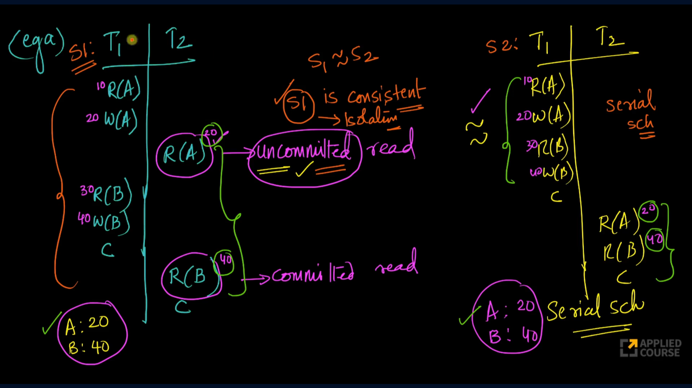
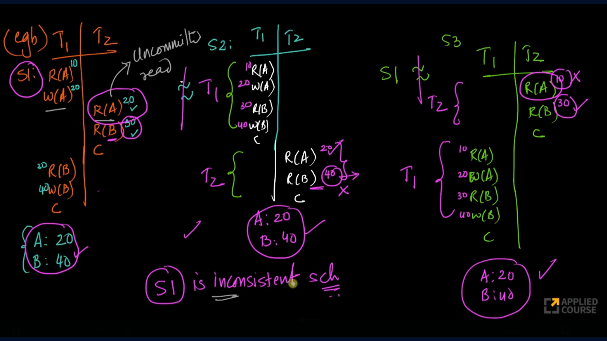
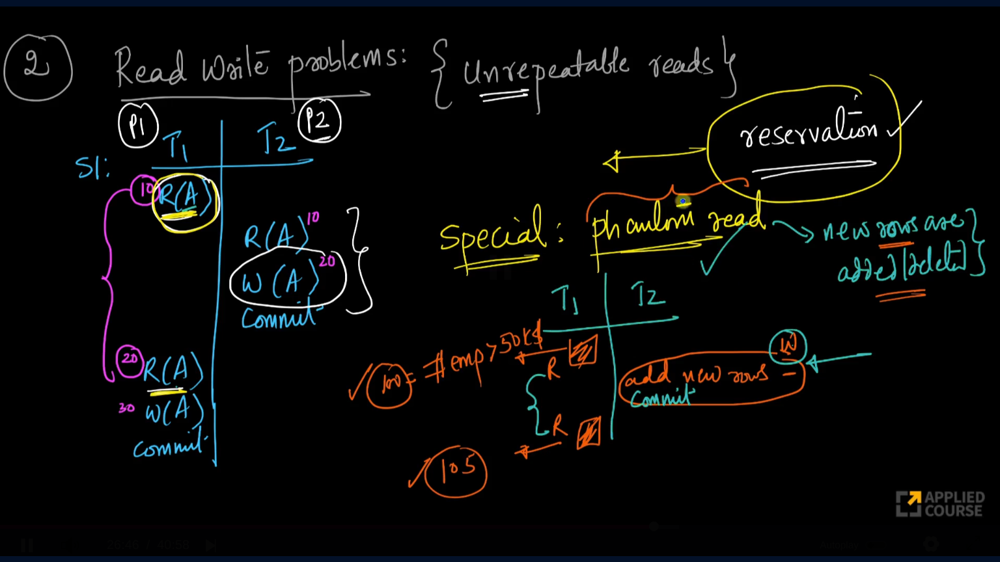
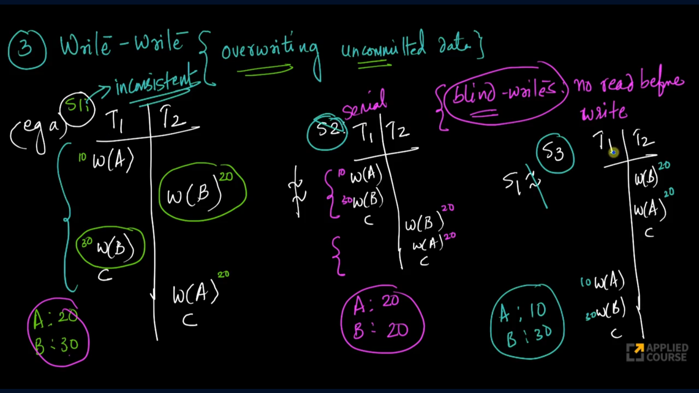
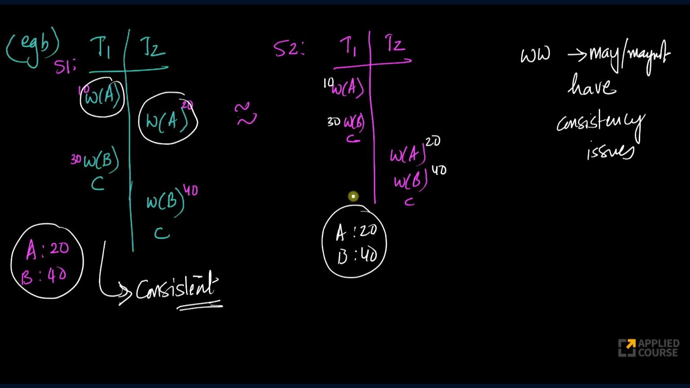
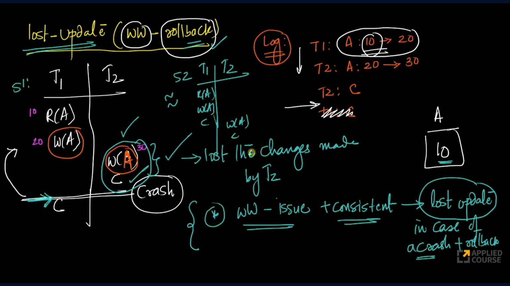

## Transaction
A transaction consists of one or more database operations that must be executed as a single unit. Transactions are widely used in banking systems, reservation systems, e-commerce applications, and any system that manages critical data.

Consider the operation:

**Transfer ₹500 from Account A to Account B**

This seemingly simple operation involves multiple steps:

1. Read balance of A from disk into memory. 
2. Verify that A has sufficient funds. 
3. Update A's balance in memory. 
4. Write the updated balance of A to the database. 
5. Read balance of B from disk into memory. 
6. Update B's balance in memory. 
7. Write the updated balance of B to the database. 
8. Commit the transaction.

During execution, failures such as power outages, process crashes, network failures, or disk failures may occur. To maintain correctness despite such failures, database systems implement the ACID properties.

---

## ACID
ACID stands for:

- Atomicity
- Consistency
- Isolation
- Durability

Every transaction should satisfy these properties.

### 1. Atomicity
Atomicity guarantees that a transaction is treated as a single indivisible unit.

Either:

- All operations are successfully completed and committed, or 
- None of the operations take effect.

Partial execution must never be visible.

#### Example
Consider transferring ₹500 from A to B.

Initial balances:

```text
A = 1000
B = 2000
```

Suppose the system crashes after deducting ₹500 from A but before crediting B.

Without atomicity:

```text
A = 500
B = 2000
```

Money has effectively disappeared.

To maintain atomicity, the database must either:

Complete the remaining operations, or
Undo all changes performed by the transaction.

The database therefore moves back to a consistent state.

One of the strategies of recovery is log based recovery, where we maintain a log file by appending each operation into it. Consider the same transfer example.

**Log file**
1. T1 at 5:51pm
2. A balance = 1000
3. Write A balance = 500
4. B balance = 2000

The log file ends here before even commiting because of the crash. When DBMS restarts, the recovery manager will read the log file and then undo the incomplete transaction T1.

### 2. Consistency
Consistency ensures that a transaction preserves all database rules and constraints, moving the database from one valid state to another valid state.

#### Example 
If we consider the same example of transfer 500, the consistency check that can be made is the sum of two balances should be the same before and after the transaction is made if the transfer is an intra bank transfer.

---

Before understanding isolation we need to know the following:
### Concurrency
Concurrency refers to multiple transactions occurring simultaneously. In any large-scale system, concurrent transactions are inevitable, because many users and processes interact with the system at the same time.

Let's consider there are two transactions T1 and T2. 
```text
T1 transfer 500 from A to B. 
T2 transfers 10 from B to A.
```
If we write these transactions in simpler format we can write them as:
```text
T1:
    1. Subtract 500 from A.
    2. Add 500 to B.

T2:
    1. Subtract 10 from B.
    2. Add 10 to A.
```

We will consider each transaction is executed as a separate process. Hence, we can call T1, T2 as P1, P2. 

As we know processes interleave because operating system always tries to increase throughput(perform multiple operations with in less time).

Some of the possible permutations of interleaving processes are:

```text
P1.1, P1.2, P2.1, and P2.2. (or)
P1.1, P2.1, P2.2, and P1.2 (or)
P1.1, P2.1, P1.2, and P2.2. (or)
....
```
From above permutations, we have noticed that **processes order might change**, but the **instructions order inside the process will not change**.

---

## Transaction Schedules

When multiple transactions execute simultaneously, the order in which operations execute is called a schedule.

### 1. Serial Schedule
Transactions execute one after another.

Example:
```text
T1 executes completely
T2 executes completely
```
There is no interleaving.

### 2. Concurrent Schedule
Operations of different transactions are interleaved.

Example:
```text
T1 Step 1
T2 Step 1
T1 Step 2
T2 Step 2
```

Any concurrent schedule which is equal to serial schedule, then the schedule is called serializable.

Concurrent execution improves throughput and resource utilization.

However, it may introduce anomalies.

### Counting Concurrent Schedules
Let us consider there are 3 transactions. T1 has n operations, T2 has m operations, and T3 has k operations.

In total, we have n+m+k operations, and we have to schedule these transactions such that the order of instructions inside a same transaction should not change.

We will try to use combinatorics to schedule the transactions as mentioned below:
```text
1. Schedule all `n` operations from `n+m+k` operations - Select n slots from (n+m+k).
2. Schedule all `m` operations from `m+k` operations - Select m slots from (m+k).
3. Schedule all `k` operations from `k` operations - Select k slots from (k).
```

Total number of concurrent schedules:
$$\binom{n+m+k}{n} .  \binom{m+k}{m} . \binom{k}{k}$$

### 3. Isolation
Isolation ensures that concurrently executing transactions do not interfere with each other and the effect of concurrent execution should be equivalent to some valid serial execution of those transactions.

Example

Consider two transactions:
```text
T1:
Transfer ₹500 from A to B

T2:
Transfer ₹10 from B to A
```
The database may execute them concurrently:
```text
T1 Step 1
T2 Step 1
T1 Step 2
T2 Step 2
...
```
Even though operations are interleaved, the final result should be equivalent to some serial order:

```text
T1 → T2

or

T2 → T1
```

This property is achieved through concurrency-control mechanisms such as locking and MVCC.

### 4. Durability
Durability guarantees that once a transaction commits its effect must be stored in a non-volatile memory which itself must be recoverable from failures such as DB failure.

The changes must survive:
- Process crashes 
- Power failures 
- Database crashes 
- System restarts

Example
After a successful transfer:
```text
COMMIT T1
```

The balances must remain updated even if the server immediately crashes.

Databases achieve durability using:
- Transaction logs (Write-Ahead Logging)
- Checkpoints 
- Replication 
- RAID storage systems

#### RAID
One of the strategy to recover from disk failures is RAID meanining **Redundant Array of Independent Disks**. The concept is simple, whatever information is being written to Disk-01 or primary disk is also written to other disks. Simply duplicating the data.
```text
RAID - 0 (only main disk)
RAID - 1 (main disk + 1 copy)
RAID - 2 (main disk + 2 copy) -- Most widely used
```
---

## Problems due to concurrency
### 1. Write-Read / Dirty Read / Uncommited Read Problem
A dirty read occurs when a transaction reads data written by another transaction that has not yet committed.

**Example - 1**:
Consider a table has two rows A and B with balance as a column and there are two transactions
```text
T1: 
    1. Read A 
    2. Write A to 20 
    3. Read B 
    4. Write B to 40 
T2: 
    1. Read A
    2. Read B
```

| Row | Balance |
|-----|---------|
| A   | 10      |
| B   | 30      |


From the image, we can see that concurrent schedule S1 has uncommited read. 

Imagine if there is no crash happened 
- The values read and written by both transactions in schedule S1 are equivalent to those observed in the corresponding serial schedule. 
- Therefore, any decisions or computations based on these values will produce the same outcome as in the serial execution. 
- Hence, S1 is equivalent to a serial schedule and can be considered a serializable (i.e., logically consistent) schedule.
- As the schedule is serializable it follows isolation.

In case of any crash it is not serializable because of dirty read happened and there is a possibility that the transaction T1 might not commit.

**Example - 2**:
Consider a table has two rows A and B with balance as a column and there are two transaction
```text
T1: 
    1. Read A 
    2. Write A to 20 
    3. Read B 
    4. Write B to 40 
T2: 
    1. Read A
    2. Read B
```

| Row | Balance |
|-----|---------|
| A   | 10      |
| B   | 30      |


From the image, we can see that concurrent schedule S1 has uncommited read.

Even if we assume that no transaction aborts or crashes during execution, this schedule is not equivalent to any valid serial schedule. The values read by the transactions at certain steps do not match those produced by any possible serial execution. As a result, computations or decisions based on these values may differ from those of a serial schedule, leading to incorrect behavior. Therefore, the schedule is not serializable.


In case of any crash it is not serializable because of dirty read happened and there is a possibility that the transaction T1 might not commit.

### 2. Read Write Problem / Non-Repeatable Read
A Read Write problem / non-repeatable read occurs when the same row is read multiple times within a transaction and its value changes due to another committed transaction.

#### Phantom Read
A phantom read occurs when repeated execution of the same query returns a different set of rows because another transaction inserts, deletes, or modifies rows that match the query condition.



In the above example, 
- We read the same row two times in the same transaction, first time the value is 10, second time is changed to 20 which is non-repeatable read.
- In special case, first time the no. of rows of a query (emp_sal>50k) is 100, second time the no. of rows of the same query changed to 105 because another transaction has added new rows.

### 3. Write-Write Problem/Lost Update Problem/ Overwriting uncommited data
A write-write problem occurs when two concurrent transactions update the same data, and one update overwrites the other, causing a lost update.

#### Example-1
The following example has consistency issues because the final values of concurrent schedule does not match either of the serial schedules that are possible.


#### Example-2
The following example does not have consistency issues because the final values of concurrent schedule match either of the serial schedules (S1).


#### Lost Update due to log based recovery
The below example shows lost update of commited transaction due another transaction failure and log based rollback.



>All the Read-Write, Write-Read, Write-Write may or may not cause consistency issues.

There is no read-read problem because there is no data change will happen.