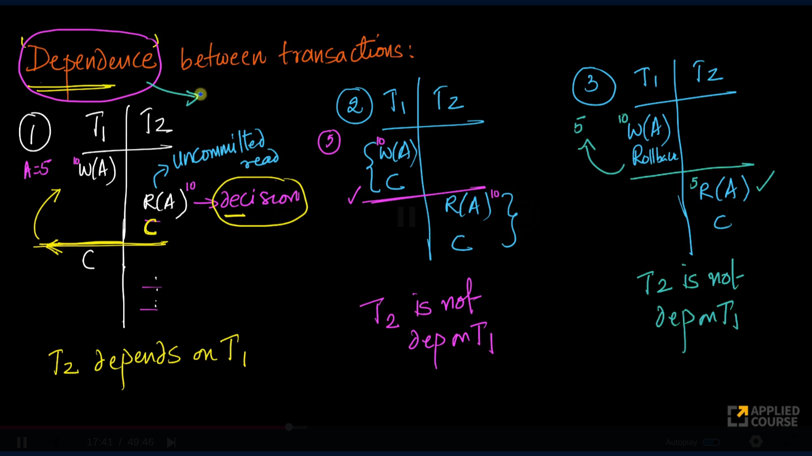
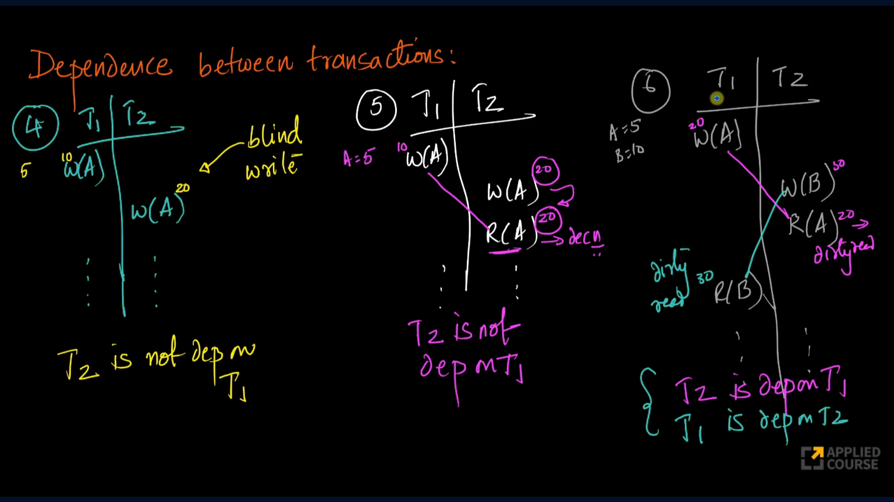
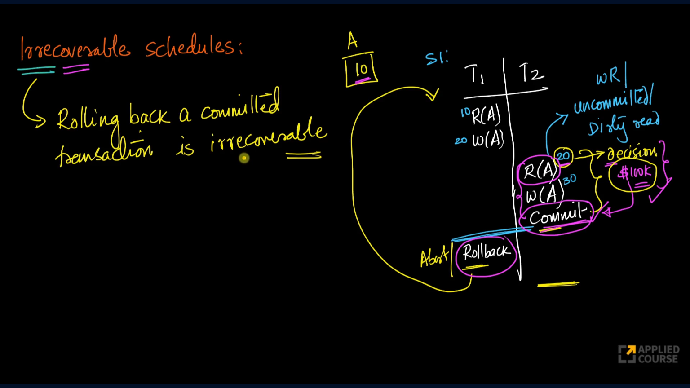
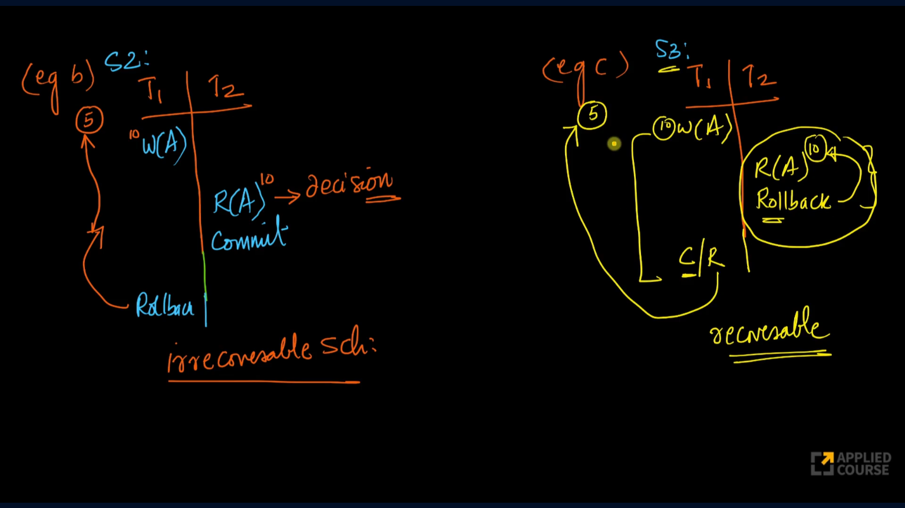
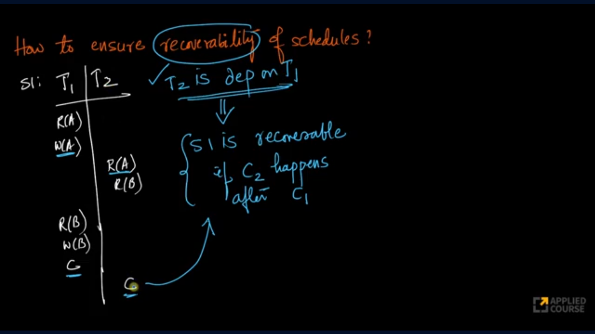
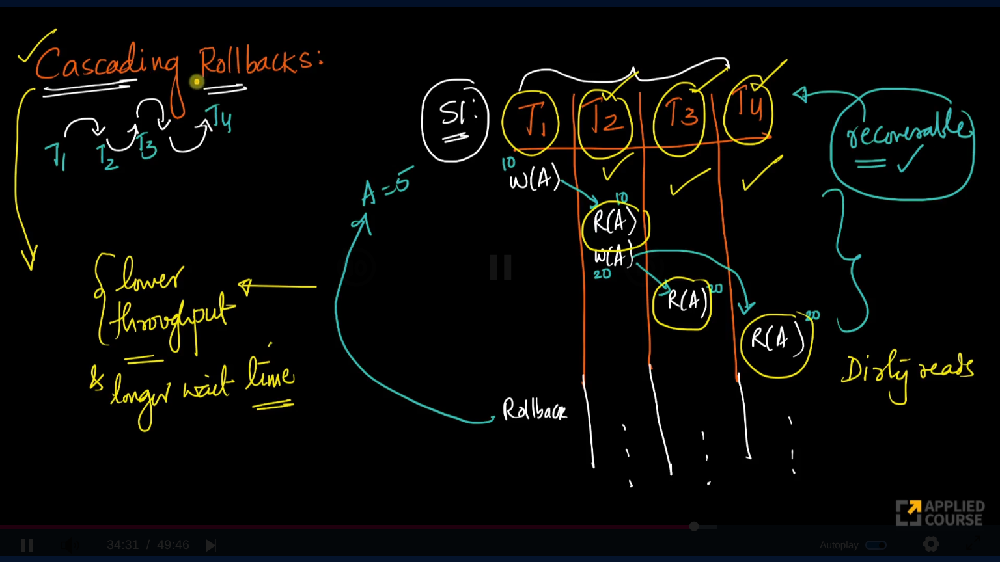
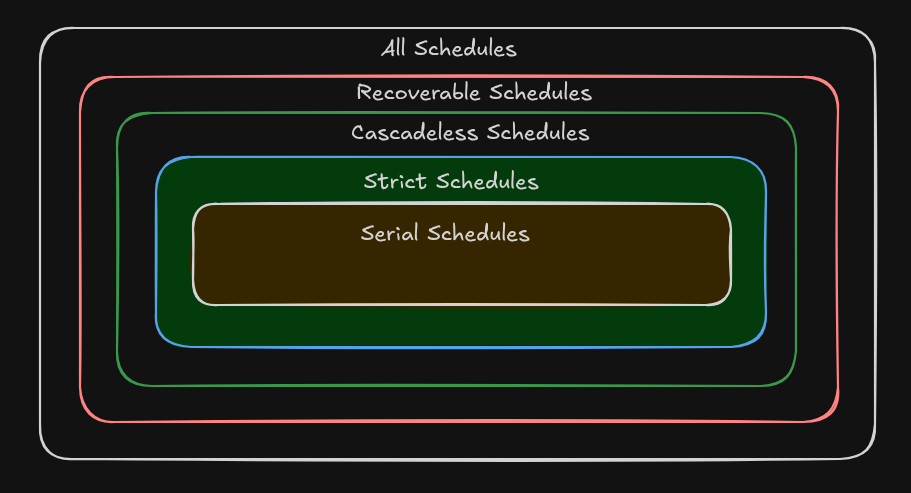

## Recoverability
Recoverability refers to the ability of a schedule to recover safely from transaction failures without leaving the database in an inconsistent state.

When multiple transactions execute concurrently, one transaction may read data written by another transaction before it commits. If the writer transaction later aborts, the database must ensure that no committed transaction depends on those invalid changes.

The goal of recoverability is to guarantee that the database can always return to a correct state after a transaction failure.

## Transaction Dependency
A transaction is said to depend on another transaction if it reads data written by that transaction before the writer commits.

Examples to demonstrate dependence of transactions are as follows.



# Types of Recoverability

## Irrecoverable Schedules
A schedule is called irrecoverable if a transaction commits after reading uncommitted data from another transaction, and the transaction that produced that data later aborts.

In such situations, the committed transaction has already made permanent decisions based on invalid data. Since committed transactions cannot normally be rolled back, recovery becomes impossible.

### Example - 1 
There are 10k dollars in account of A and there are two transactions need to be performed.
```text
T1: Deposit 10k dollars into account of A.
T2: If account balance is >= 20k dollars then Deposit 20k dollars else deposit 10k dollars as loan
```
If we consider the concurrent schedule (S1) mentioned in the below image. T1 started and deposited the amount but not commited yet. Then T2 **read the uncommited value, made a business decision of giving a loan and T2 is commited.** 

Now there is a crash and T1 is never commited. When the DB restarts it rollbacks the transaction T1, but there is a wrong business decision made.

### Example - 2
In the below image, there are two examples the 1st one is irrecoverable and the other one is recoverable.


Schedule S2: T2 made a business decision based on uncommited value written by T1 and T2 is commited. But when the transaction T1 is rolled back, the decision taken by T2 is never reverted causing a incorrect decision. So it is irrecoverable.

Schedule S3: T2 made a business decision based on uncommited value written by T1 but, T2 rolled back so there is no issue whether the T1 commits or rollbacks later because there is no action performed by T2.

## Recoverable schedules
A schedule is recoverable if every dependent transaction commits only after the transaction it depends on has committed.



If we see the above example, schedule is recoverable because T2 commits only after T1 commits.

Notice that a dirty read still occurred, but the schedule remains recoverable because no dependent transaction committed before the transaction it depended on.

**Therefore: A recoverable schedule may still contain dirty reads.**
### Cascading Rollbacks
Although recoverable schedules guarantee correct recovery, they may still suffer from cascading rollbacks.

Consider the below example, there are 4 transactions which have dirty reads in all the transactions.

The following schedule is recoverable because the dependent transactions T2, T3, and T4 commits after T1. 


If transaction T1 aborts, then remaining transactions T2, T3 and T4 will also abort. And the rollback propagates through all dependent transactions.

This phenomenon is called a **cascading rollback (or cascading abort).**

#### Problems
- Wasted computation
- Reduced throughput
- Increased response times
- Longer transaction wait times

Therefore, modern database systems try to avoid cascading rollbacks.

## Cascadeless Schedules
As we want to avoid cascading aborts we must have to prevent **uncommited/dirty reads** so that the cascading rollbacks doesn't even occur.

A schedule is called cascadeless if transactions are not allowed to read uncommitted data.

Since dirty reads are prevented, transaction dependencies based on uncommitted data cannot occur.

As a result:
```text
No dirty reads
No cascading rollbacks
```

Every cascadeless schedule is automatically recoverable.

However, cascadeless schedules do not prevent all concurrency problems.

The following may still occur:
- Non-repeatable reads 
- Phantom reads 
- Write-Write conflicts

## Strict Schedules
A schedule is called **strict** if a transaction is not allowed to read or write a data item modified by another uncommitted transaction.

If T1 performs a writes on a row A, then T2 is not allowed to write A or read A till T1 commits/rollbacks.

Strict schedules prevent:
- Dirty reads 
- Cascading rollbacks 
- Lost updates caused by overwriting uncommitted data

Because of these advantages, strict schedules are widely used in practical database systems.

Many locking-based concurrency-control mechanisms are designed to guarantee strict schedules.

## Serial Schedules
A serial schedule executes transactions one after another without any interleaving.

Example:
```text
T1 executes completely

T2 executes completely

T3 executes completely
```
**Characteristics:**
1. No concurrency 
2. No concurrency anomalies 
3. Always recoverable 
4. Always cascadeless 
5. Always strict

However, serial execution significantly reduces throughput and resource utilization.

For this reason, databases allow concurrent execution while attempting to preserve the correctness properties of serial schedules.

### Hierarchy of Schedules


Meaning:
- Every Serial schedule is Strict. 
- Every Strict schedule is Cascadeless. 
- Every Cascadeless schedule is Recoverable. 
- The reverse is not necessarily true.

## Steps to identify type of schedule
### Step 1: Check Recoverability
```text
If T2 reads data written by T1:

T1: Write(A)

T2: Read(A)

then:

Commit(T1) must occur before Commit(T2)
```
If not, the schedule is irrecoverable.

### Step 2: Check Cascadeless Property
Ask: Did any transaction read uncommitted data?

If the answer is no: Schedule is Cascadeless

### Step 3: Check Strictness
Ask: Did any transaction read or write data modified by an uncommitted transaction?

If the answer is no: Schedule is Strict

### Step 4: Check Seriality
Ask: Are transactions executed completely without interleaving?

If yes: Schedule is Serial

A serial schedule automatically satisfies all the properties of Strict, Cascadeless, and Recoverable schedules.