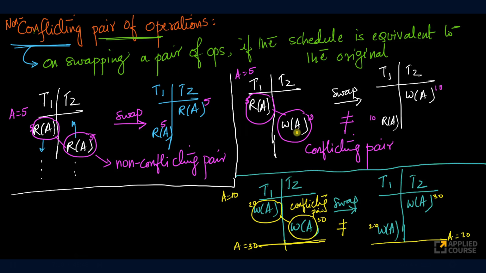
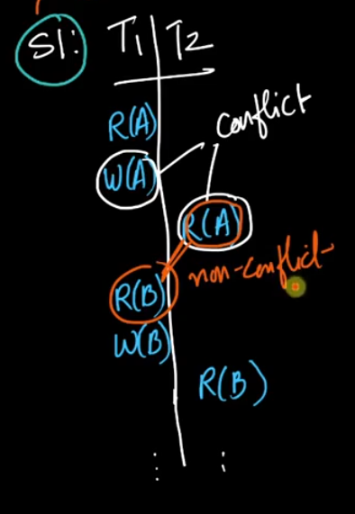
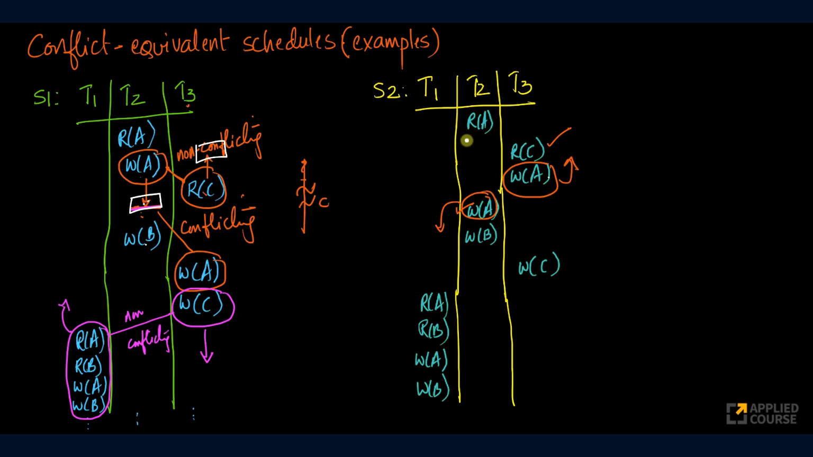
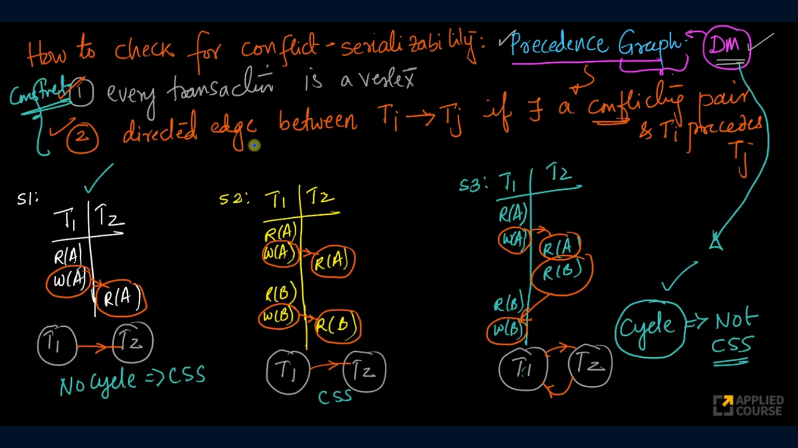
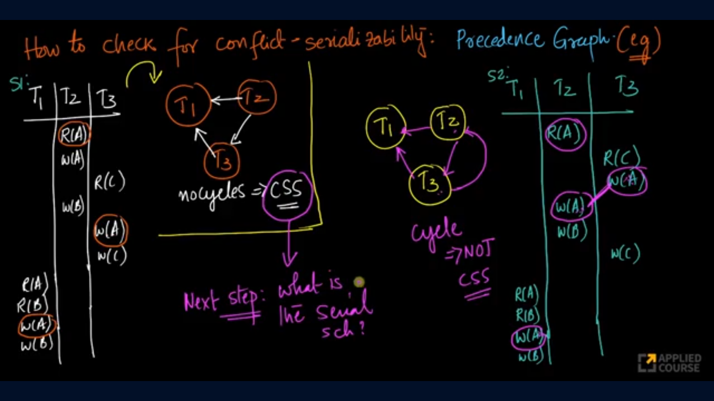
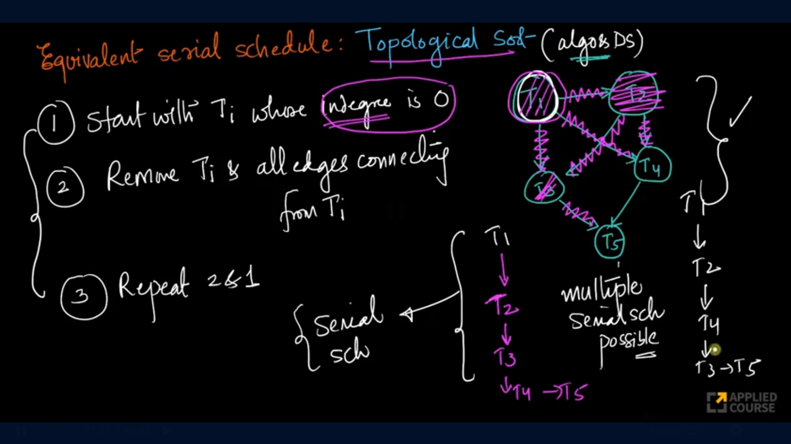
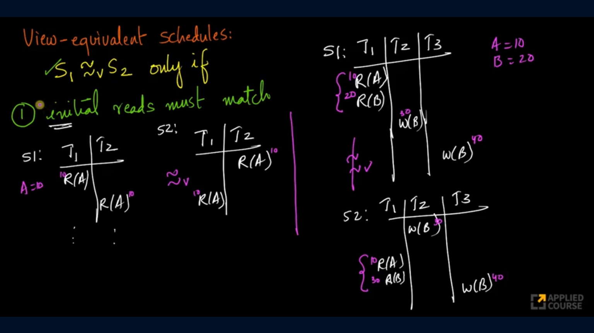
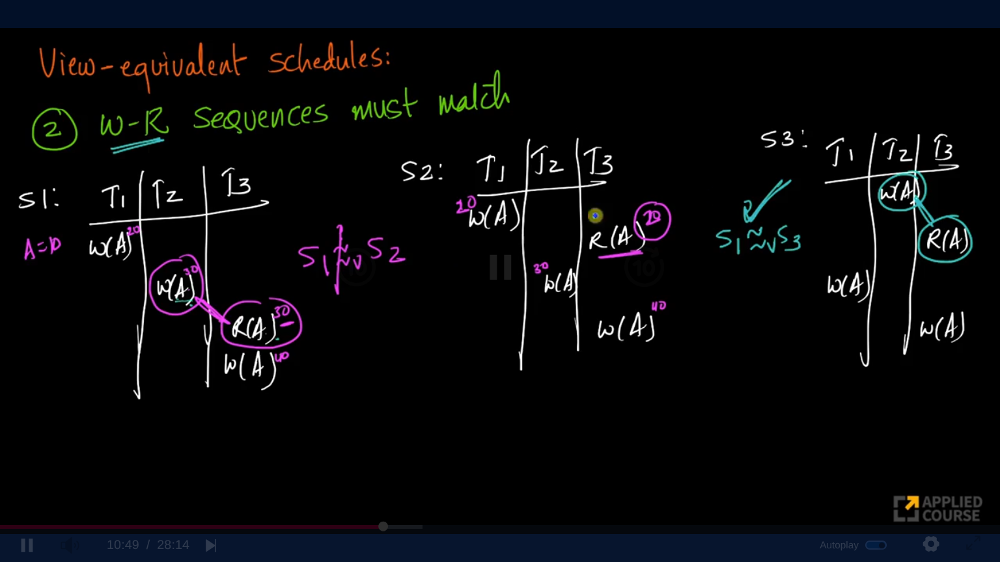
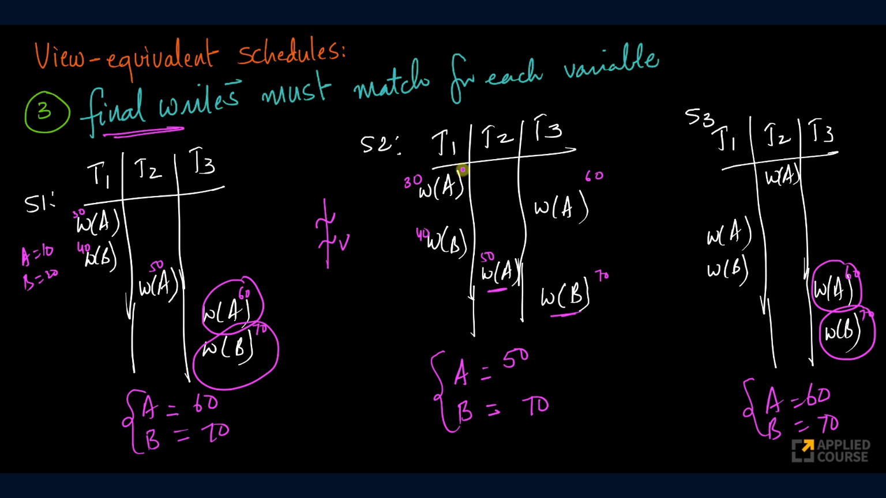
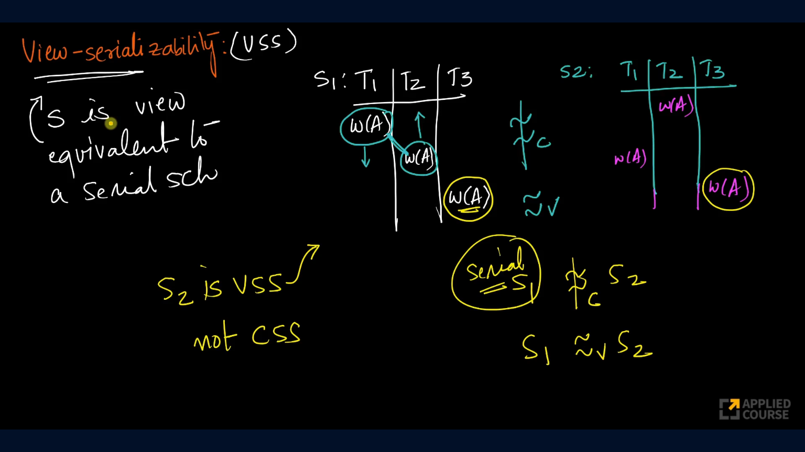

## Serializability
Even if transactions run concurrently, the final result should be equivalent to some serial execution. This property is called serializability.

A schedule is serializable if a concurrent schedule produces same final database state and same effect on data similar to that of any serial schedule.

## Types of Serializability
There are two types of serializability
1. Conflict Serializability
2. View Serializability

### Non-Conflicting Pair of Operations
On swapping a pair of operations if the resultant schedule is equal to the original schedule then that pair of operations are called non-conflicting pair of operations.

### Conflicting Pair of Operations
Conflicting Pairs should satisfy all the following rules:
1. Both operations should not belong to same transaction.
2. Both operations must be performed on same data.
3. One of the operations must be a write operation.

### Conflict Equivalent Schedules
S1 is conflict equivalent to S2 if, S1 results in S2 from swapping non-conflicting pairs. 

## Conflict Serializable Schedule (CSS)
A concurrent schedule S1 is said to be conflict serializable schedule if and only if there exists a serial schedule S2 such that S1 is conflict equivalent to S2.
### How to check for conflict serializability
1. To check for conflict serializability we use precedence graphs
2. Given any number of transactions we draw precedence graph as follows:
   1. Every transaction is a vertex
   2. Insert a directed edge between Ti and Tj if there exists a conflicting pair Ti, Tj and operation in Ti precedes operation in Tj.
3. If there is any cycle in the graph, then it is not conflict serializable.

4. Find the serial schedule equivalent to CSS.

5. **Note:** If a schedule is Conflict Serializable then it is Serializable schedule but if it is only Serializable schedule it is not Conflict Serializable schedule.

## View Serializable Schedule (VSS)
To understand view serializability we need to understand view equivalence.

### View Equivalence
A schedule S1 is view equivalent to S2 if all the below conditions are true:
1. Initial reads must match
2. Write-Read operations must match
3. Final writes must match for each variable

>S1 is view serializable if it is view equivalent to any serial schedule. 

Below example shows a schedule can be view serializable but not conflict serializable.

**Most Databases prefer a schedule which strict schedule and view serializable**
