# Lock Based Concurrency Control
DBMS uses locks provided by operating system to perform locking. We will try to acheive both recoverability and serializability using locks. 

Transaction lock cycle would be as follows:
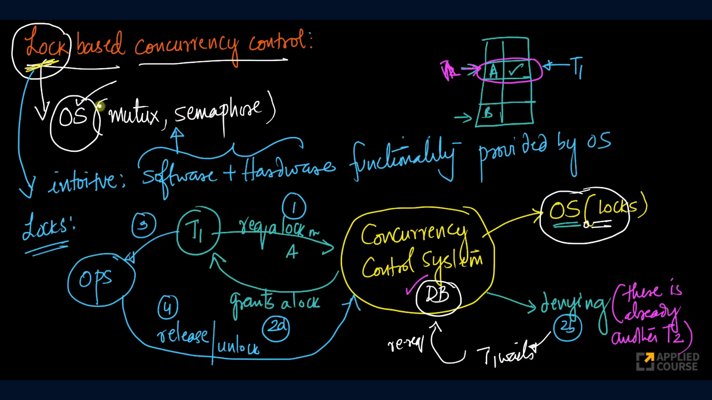
There are two types of locks used in DBMS:
1. Shared Locks
2. Exclusive Locks

### 1. Shared Lock
Shared lock is used as read lock, a transaction which acquires a shared lock can only read the data.

Multiple transactions can hold onto the same shared lock. If there is a shared lock acquired an exclusive lock cannot be provided to any transaction.

### 2. Exclusive Lock
Exclusive lock is used as write lock, a transaction which acquires an exclusive lock can read and write the data.

Once a transaction acquires an exclusive lock no other transaction can either acquire shared or exclusive lock.

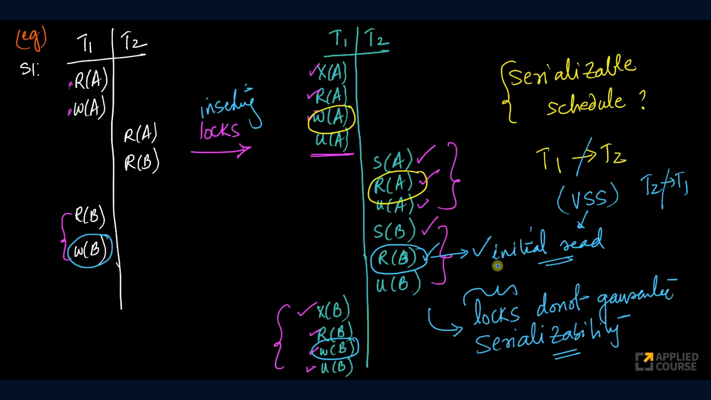

From the above image, we can see that locks does not guarantee serializability. By enforcing some rules we will try to achieve both recoverability and serializability.

## 2-phase locking protocol
2-phase locking guarantees conflict serializability meaning the schedule is serializable. As the name suggests there are two phases in this protocol.
1. Growing or Expanding Phase: In this phase transactions will acquire locks
2. Shrinking Phase: In this phase transactions will release locks

Rules imposed by 2PL are:
1. Ti cannot acquire a lock after a lock is released.
In growing phase transactions will acquire locks. Simply, if you start releasing locks (entering shrinking phase) then you  cannot acquire locks (cannot enter growing phase again).
2. On commit/rollback all locks are released.

The point at which the last acquisition of lock or the position of the first lock release is called **Lock point**.

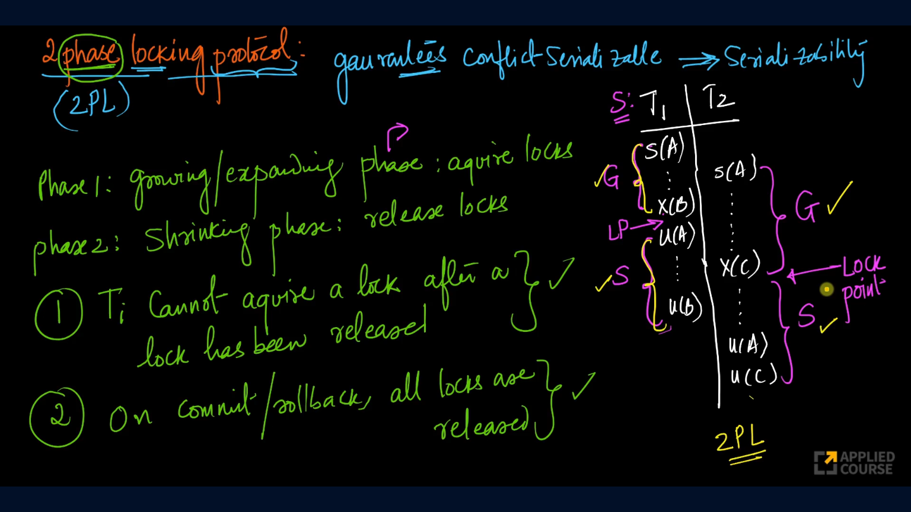

If we can clearly identify the growing, shrinking phases and the lock point for each individual transactions then the schedule follows 2PL.

If the schedule follows 2PL and want to identify the respective serial schedule we just need to follow the lock points.
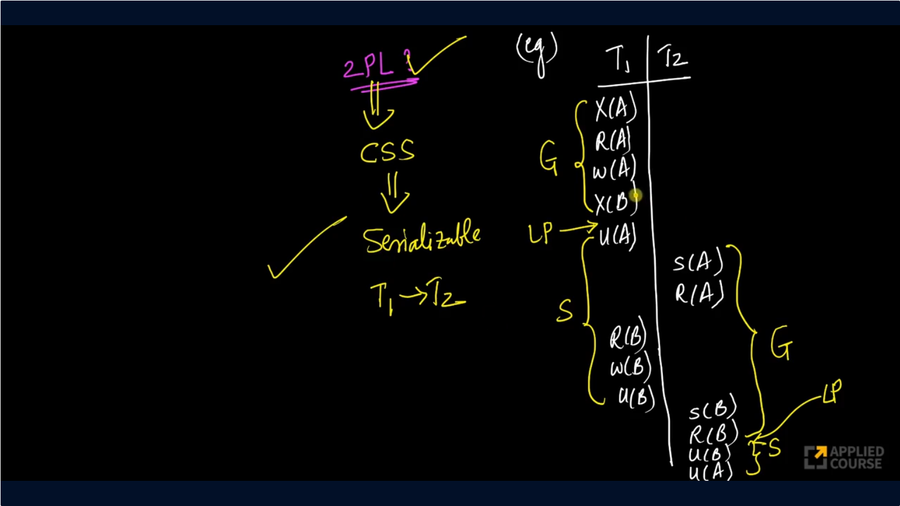

## Lock Upgradation
Shared lock can be upgraded to exclusive lock if there is only one shared lock is held by current transaction and there is no need to unlock it before upgrading.

2PL + lock upgradation is a separate concept which eases the rules of 2PL also guarantees the conflict serializability. The following image shows this
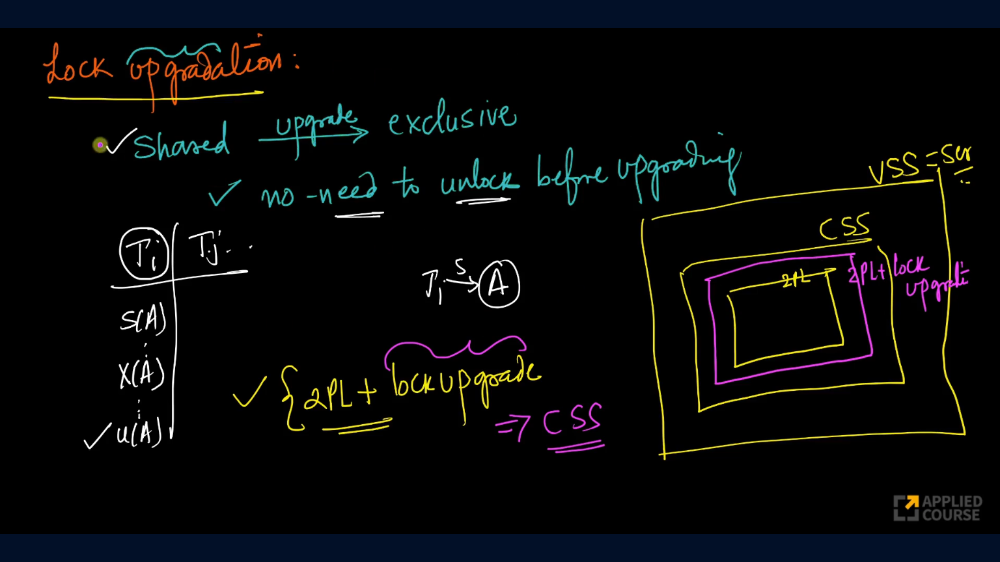

From the following example we can see that 2PL can guarantee serializability but not the recoverability. So we need to some more rules to 2PL to achieve both serializability and recoverability.
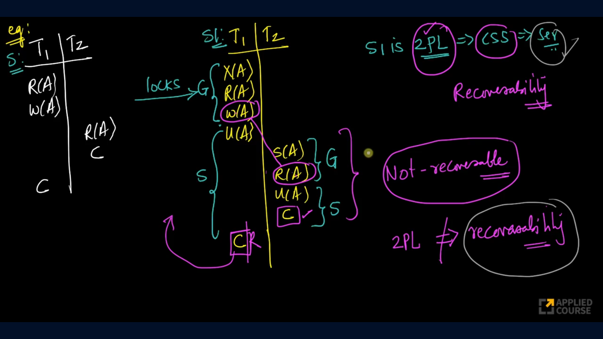

## Strict 2PL
Strict 2PL guarantees the conflict serializability and strict recoverability. Strict 2PL follows 2PL rules and in addition to that the following rules should satisfy: 
- All exclusive locks must be released only after commit/rollback happens.
- Shared locks doesn't have any restrictions.

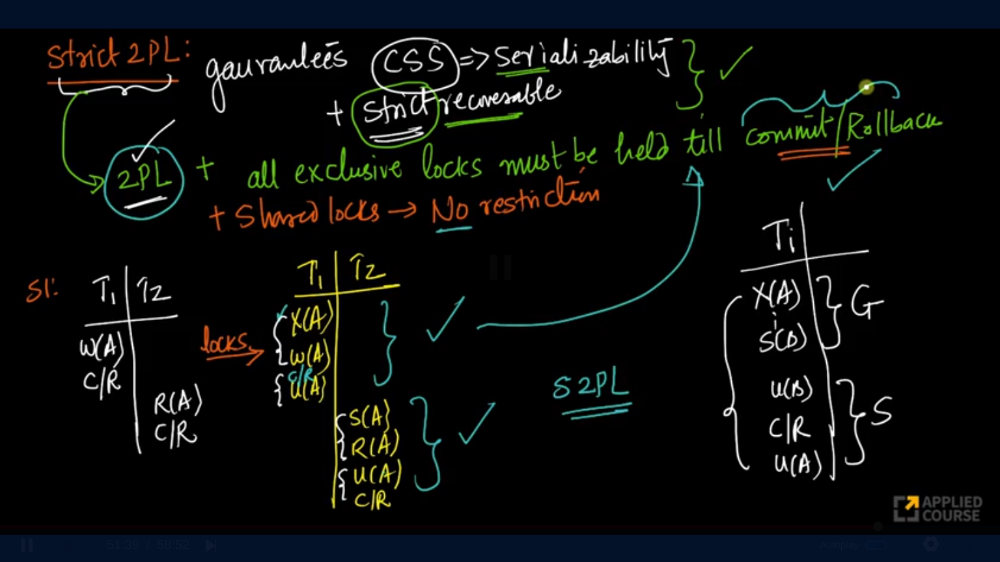

## Strong Strict 2PL / Rigorous Strict 2PL
Strong Strict 2PL follows 2PL rules and in addition to that all locks(exclusive + shared) must be released only after commit/rollback.

**Note:** 2PL, Strict 2PL have deadlock and starvation problems 

# Timestamp Based Protocol
In timestamp based protocols, each transaction will be assigned with a time stamp and the tuples/rows of the table will be assigned with Read Timestamp and Write Timestamp. 

Timestamp Based protocols are alternatives for lock based protocols.

## Generate Timestamp
There are two ways to generate timestamp:
1. We can use the system time of operating system as timestamp
2. Generate a time stamp using a shared counter

TimeStamp Based Protocol wants our schedule to be equivalent to a serial schedule in which transactions are ordered in increasing timestamp. This rule guarantees our schedule to be serializable.

The following rules are defined by TimeStamp Based Protocol
1. Each transaction should obtain a unique timestamp at the start of the transaction.
2. Each data item also has time stamps.
   1. Read Time stamp 
   2. Write Time stamp
3. If a transaction **T wants to Read A**
   1. If timestamp of T < write time stamp of A: RollBack and restart T.
   2. If timestamp of T > write time stamp of A: Execute the operation and update read timestamp of A to max(read timestamp of A, timestamp of T).

    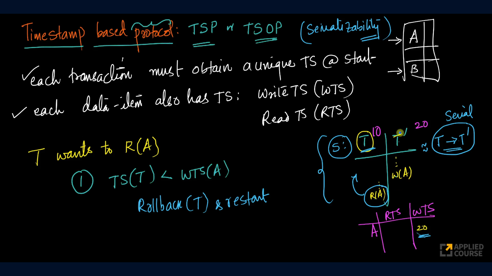
    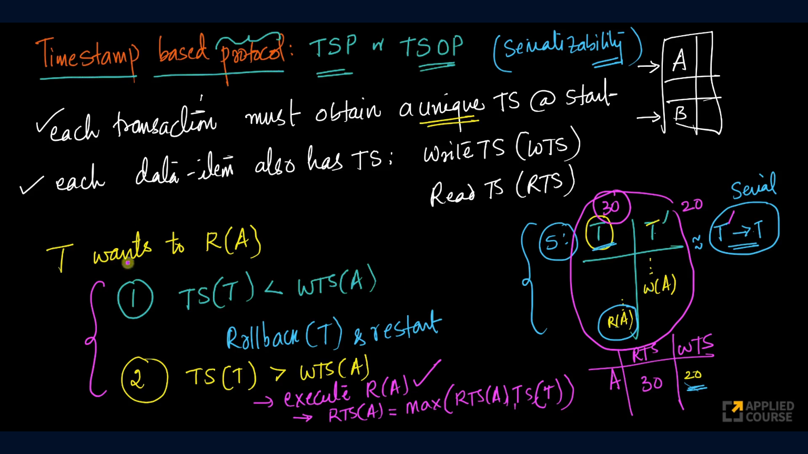
4. If a transaction **T wants to Write A**
   1. If read timestamp of A > timestamp of T: Rollback and restart T. 
      1. Why? Because TSP says the current schedule should be equivalent to serial schedule in which order of transactions should be increased order of time stamps. But from the above condition, we can see that there is a transaction which has greater timestamp than T but already read the value of A. But if the schedule has to follow serial schedule then it should have read the value after transaction T is done.
   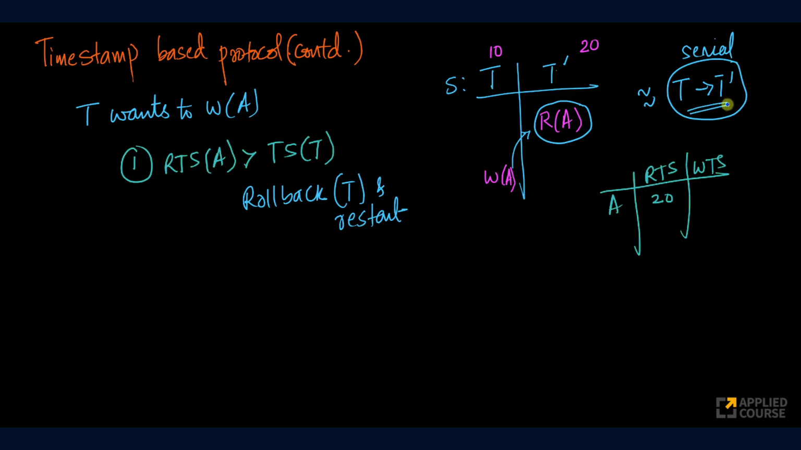
   2. If write timestamp of A > timestamp of T: Rollback and restart T.
      1. Why? Because T has smaller timestamp and first T should write to A then the other transaction with greater timestamp than T should write to A. But here some other transaction with greater timestamp has already written to A.
   3. Execute the write operation and set write timestamp of A to timestamp of T.

TSP guarantees the conflict serializability because it doesn't allow dirty reads. To get the equivalent serializable schedule we can follow the timestamps in increasing order

TSP doesn't allow transactions of a schedule to have deadlocks. Example is shown in the below image
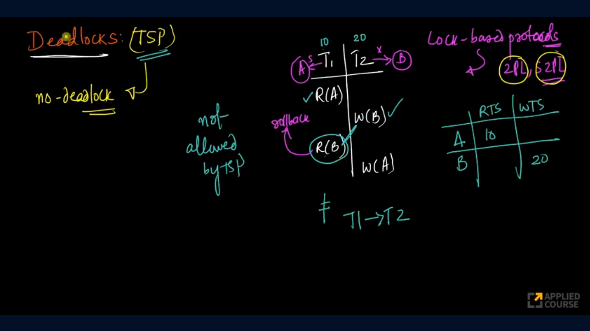

TSP doesn't guarantee recoverability and starvation free schedule.
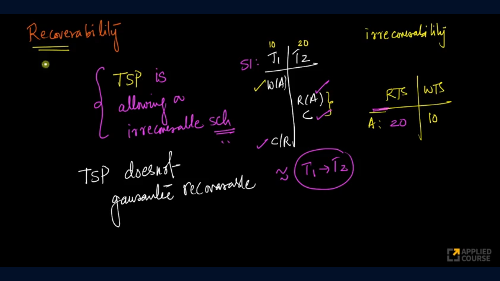
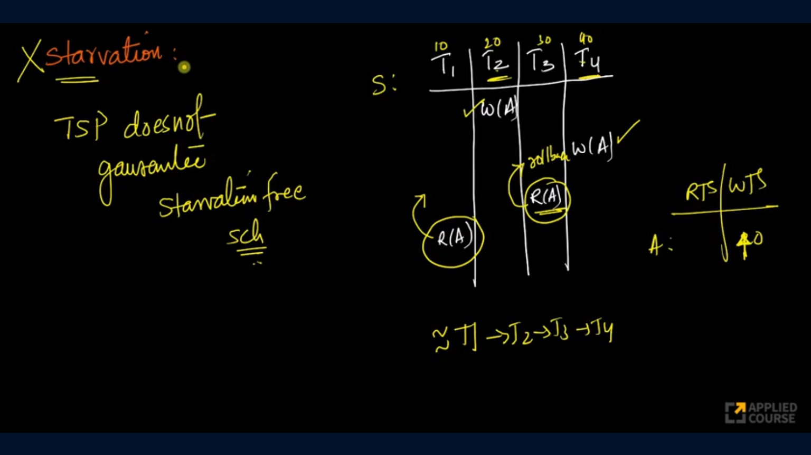
From the above image we can see that the transactions T2 and T4  are causing the transactions T1 and T3 to rollback which results in starvation of transactions with smaller timestamps.

## Strict Timestamp Based Protocol
Strict Timestamp Based Protocol follows the rules of TSP in addition to that it adds one more rule to remove the Write-Read and Write-Write problems:
- If a transaction wants to read or write an item that has been written by an uncommitted transaction, it must wait until that transaction commits or aborts.

By following the above rule Strict TSP guarantees the strict recoverability.

Strict TimeStamp Based Protocol does not guarantee starvation. 

## Using TSP to prevent deadlocks and starvation in lock based protocol
There are two strategies using tsp and locks to remove both deadlocks and starvation from a schedule
1. Wait-Die
2. Wound-Wait

## 1. Wait-Die
- If an older transaction is waiting for younger transaction to release a lock then wait for the lock to release.
- If a younger transaction is waiting for older transaction to release a lock then abort/rollback the younger transaction.

## 2. Wound-Wait
- If an older transaction is waiting for younger transaction to release a lock then abort/rollback the younger transaction.
- If a younger transaction is waiting for older transaction to release a lock then wait for the lock to release.

Why, in both strategies we abort younger transaction because the older transaction might have completed more operations, so it is better to abort younger one.

> If we have Strict 2PL and Wound Wait, then the schedule becomes conflict serializable, strict recoverable, no deadlocks and no starvation.

## Thomas Write Rule
Consider a timestamp-based protocol where transaction T wants to write to data item A. According to the protocol, if the write timestamp of A is greater than the timestamp of T, then T is rolled back. However, instead of rolling back T, we could simply ignore the write operation. Since a transaction with a higher timestamp has already written to A, the final value should come from that newer transaction anyway. Ignoring the current write would therefore produce the same final result without requiring a rollback.
