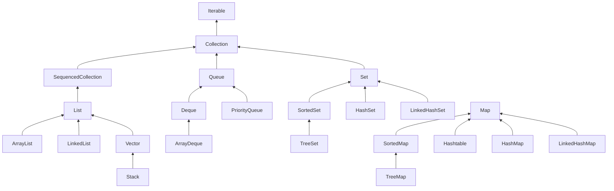

# Collection Framework

## Interfaces

### 1. Iterable
Iterable interface provides the iterator method which should be implemented by the concrete classes. Iterator also provides `forEach` as default method and splitIterator also.
    1. TODO: SplitIterator

### 2. Collection
Collection interface extends **Iterable** and provides the following methods `add`, `addAll`, `remove`, `removeAll`, `clear`, `contains`, `containsAll`, `equals`, `size`, `isEmpty`, `iterator`, `stream`, `parallelStream`.

### 3. Sequenced Collection
This interface extends the **Collection** interface and provides the following abstract methods `addFirst`, `addLast`, `getFirst`, `getLast`, `reversed` and the **default methods** `removeFirst`, `removeLast`.

### 4. List
This interface extends **SequencedCollection** provides the following abstract methods `get`, `set`, `indexOf`, `lastIndexOf`, `subList`, `toArray` and **static method** `of`.

### 5. Queue
This interface extends **Collection** interface and provides the abstract methods `add`, `offer`, `remove`, `poll`, `element`, `peek`.

### 6. Set
This interface extends **Collection** interface and provides same methods as **Collection.**

### 7. Map
This interface provides the following methods, **`put`, `putIfAbsent`, `get`, `getOrDefault`, `remove`, `containsKey`,`containsValue`, `keySet`, `values`, `entrySet`, `compute`, `computeIfAbsent`, `computeIfPresent`, `merge`**

| Scenario                          | Best Choice          |
|-----------------------------------|----------------------|
| Fast random access                | ArrayList            |
| Frequent begin, middle insertions | LinkedList           |
| Unique elements                   | HashSet              |
| Ordered unique                    | LinkedHashSet        |
| Sorted data                       | TreeSet/TreeMap      |
| Fast key-value lookup             | HashMap              |
| Concurrent map                    | ConcurrentHashMap    |
| Read-heavy concurrency            | CopyOnWriteArrayList |
| Stack                             | ArrayDeque           |
| Queue                             | ArrayDeque           |