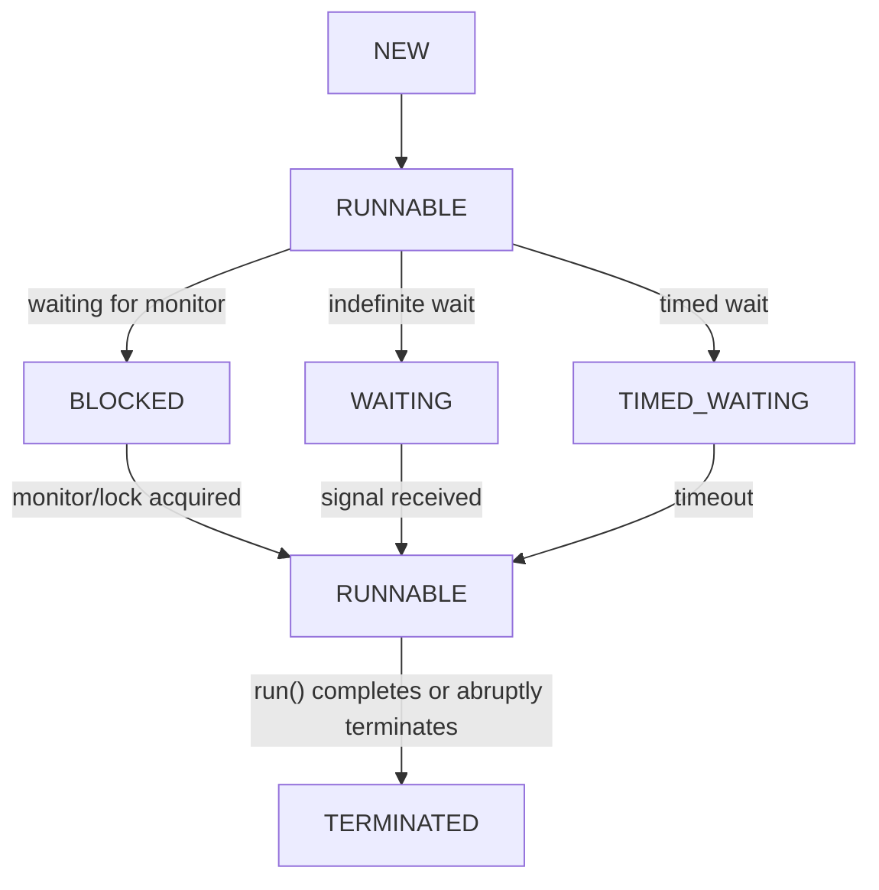

# Thread
Thread is a part of process which handles the execution of some part of the program.
## Creating thread
In java, we can create threads in the following ways
### 1. Thread Class
- `Thread` is a concrete class which internally implements runnable interface.
- A concrete class which extends the `Thread` class should override the `run` method and the Java code inside run method is executed by the thread if created and started properly.

    ```java
    public class ThreadImpl extends Thread{
        @Override
        public void run(){
            System.out.println("Thread is running");
        }
    }
    ```
### 2. Runnable Interface
- Thread can be created by passing an object of a class which implements `Runnable` to the constructor of the `Thread` class.
- As the `Runnable` is a functional interface we can use a lambda function instead of a class as well. Or can be done by `anonymous` class as well.

    ```java
    public class ThreadImpl implements Runnable{
        @Override
        public void run(){
            System.out.println("Thread is running");
        }
    }
    
    public class Main{
        public static void main(String[] args){
            // Using Runnable implementation
            ThreadImpl runnable = new ThreadImpl();
            Thread t1 = new Thread(runnable);
            t1.start();
            
            // Using Lambda
            Thread t2 = new Thread(()->System.out.print("Thread from lambda"));
        }
    }
    ```

 > **Note**: As java doesn't support multiple inheritance with classes, if we extend `Thread` class we lose the opportunity of extending other classes. So it is recommended to implement the `Runnable` interface.
 
### What does Thread receives when created?
Each running thread has its own execution-related state including:
```text
Program Counter
Java Stack
Stack Frames
Local Variables
Current Execution Position
```
Threads in the same process share the following:
```text
Heap Objects
Static Variables
Class Metadata
Open Process Resources
```
### Why `Runnable` is preferred than `Thread`?
#### 1. Separation of Concerns
`Runnable` defines what work has to be done. `Thread` defines entire thread object along with what work has to be done.

By using `Runnable` we will separate the concern of what to be performed by thread, and how to create a thread. 

#### 2. Reusability
If a task definition is created using `Runnable` the same task object can be executed by different threads, however synchronization should be handled.

#### 3. Preserves Class Inheritance 
Java support only single class inheritance. If a class extends `Thread`, it cannot extend another class. So better to implement `Runnable` as it preserves the ability to extend other classes.

#### 4. Works well with Higher Level APIs
The task oriented design of `Runnable` works with executor services. The task does not need to know which thread executes it. This separation is a major reason `Runnable` is generally preferred over extending `Thread`.

#### 5. Supports Lambda Expressions
`Runnable` is a functional interface so it supports lambda expressions.

## Thread Properties
Each thread will have some properties to define and inspect them. Some of the important properties are:
```text
Thread Id
Name
State
Priority
Daemon Status
Interrupted Status
```
- We can use `Thread.currentThread()` to get reference to the current thread in execution. On this reference the following methods can be called to know the properites.
- `getName()` and `setName(name)` is used to get and set name of the Thread.
- `getPriority()` and `setPriority(priority)` is used to get and set thread priority.
- `threadId()` is used to get the thread id(long).

## Thread Start and Execution
Inorder to make a thread execute we have two methods `start()` and `run()`. Both will make sure that the task is executed but the difference is they will differ on which thread the task is executed.

- `start()`: When this method is called then a JVM starts a new thread creation and new thread will invoke `run` method and new thread executes concurrently.
- `run()`: When this method is called the current thread will perform the task. No new thread is created.

### Can a `Thread` be started twice ?
No, a thread cannot be started twice, if we call `start()` more than once program throws `IllegalStateException`. 

A thread cannot be started again if it has:
- Already has started
- Completed normally
- Terminated because of exception.

Restarting is not allowed because a `Thread` object represent one lifecycle. After termination the lifecycle is complete and cannot restart.

### Execution Order
Thread execution order cannot be predicted because it depends on different factors. Some of them are:
1. OS scheduling
2. Other running processes
3. Thread Priority
4. Number of cores in CPU
5. System Load

Thread execution is non-deterministic meaning same program with same input can result in different outputs. When order is required we have to use proper coordination mechanisms such as locks, `join`, `wait` and `notify`, Executors, Futures, etc.

## Thread LifeCycle
A java thread passes through a defined set of states. And Java represents these states using `Thread.State` enum.
At any point of time a `Thread` will be in one of the following states as per `Thread.State` enum. `NEW`, `RUNNABLE`, `BLOCKED`, `WAITING`, `TIMED_WAITING` and `TERMINATED`.

### Simplified Thread Lifecycle Diagram

> A thread can move between `RUNNABLE`, `BLOCKED`, `WAITING` and `TIMED_WAITING` many times.

### 1. NEW
A thread is in `NEW` state after thread object has been created but before `start` is called.

### 2. RUNNABLE
A thread moves to RUNNABLE state when `start` method is called. Here the thread may be waiting for cpu or executing on cpu. Both these are represented by RUNNABLE state only.

### 3. BLOCKED
A thread enters BLOCKED state when it is waiting to acquire an intrinsic monitor lock to enter or re-enter synchronized code.

A thread entering BLOCKED state does not release any monitor locks which are already acquired.

### 4. WAITING
A thread is in WAITING state when it waits indefinitely for another thread to perform specific action.

A thread can go to WAITING by any of the following methods:
1. `lock.wait()`: When wait method of monitor lock acquired by thread is called, thread moves to WAITING and the current monitor lock is released.
2. `thread1.join()`: When thread1.join() is called current thread moves to WAITING and waits till thread1 terminates.

For the 1st case, Thread moves to RUNNABLE when lock.notify() or lock.notifyAll() is called. To execute instructions again monitor has to be acquired

For the 2nd case, Thread will either terminate or gets interrupted.

### 5. TIMED_WAITING
A thread enters TIMED_WAITING state when it waits for another action for a limited period.

A thread can go to TIMED_WAITING by any of the following methods:
1. `lock.wait(time_in_millisec)`: Current thread moves to TIMED_WAITING also releases the monitor lock and waits till timeout occurs.
2. `Thread.sleep(time_in_millisec)`: Current thread moves to TIMED_WAITING, doesn't release any lock and waits till timeout occurs.
3. `thread1.join(time_in_millisec)`: Current thread moves to TIMED_WAITING, doesn't release any unrelated monitor locks and waits till timeout occurs.

### 6. TERMINATED
A thread enters TERMINATED state when `run` execution completes normally or with an uncaught exception.

TODO: Add GitHub link demonstrating the states. Till then refer [this](https://github.com/adityatandon15/Java-Full-Course/blob/main/Lecture%2048/notes/Notes.pdf)