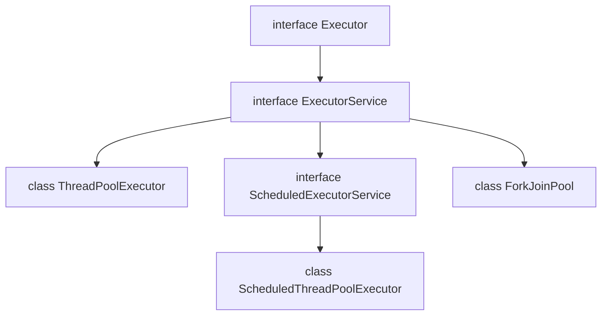

# Executor Framework

Before the Executor Framework was introduced, developers created and managed threads manually.

Problems with manual thread creation:

1. Creating threads manually is error-prone and can lead to the creation of too many threads, increasing memory consumption.
2. Creating a new thread for every task wastes CPU time because thread creation and destruction are expensive operations.
3. Managing thread lifecycle, synchronization, and resource cleanup becomes difficult as applications grow.

The **Executor Framework** automates thread management and allows developers to focus on business logic.

Internally, the framework uses a **thread pool**.

A thread pool is a collection of reusable worker threads that execute submitted tasks. Depending on the implementation, it may also contain a waiting queue.

Tasks are assigned to available threads. When all threads are busy:

1. If a waiting queue exists and has space, new tasks are stored in the queue.
2. When a thread completes its current task, it picks the next task from the queue.

What happens if the queue is also full?

The task is handled according to the configured **rejection policy** (it is not always ignored).

---

# Hierarchy



---

# Core Interfaces

## Executor

```java
interface Executor {
    void execute(Runnable command);
}
```

Provides a simple mechanism for executing tasks.

### Method

```java
void execute(Runnable task)
```

* Accepts a `Runnable`.
* Returns nothing.
* Cannot retrieve a result from the task.


## ExecutorService

```java
interface ExecutorService extends Executor {
    Future<?> submit(Runnable task);
    <T> Future<T> submit(Callable<T> task);
}
```

Provides additional functionality such as:

* Returning results
* Task cancellation
* Graceful shutdown
* Batch execution

---

# Runnable vs Callable

## Runnable

A functional interface:

```java id="vymnq6"
@FunctionalInterface
interface Runnable {
    void run();
}
```

Characteristics:

* Returns no value.
* Cannot throw checked exceptions.

## Callable

A functional interface:

```java id="3rtkhf"
@FunctionalInterface
interface Callable<T> {
    T call() throws Exception;
}
```

Characteristics:

* Returns a value.
* Can throw checked exceptions.

---

# Future

Since task execution is asynchronous, we do not know when a task will complete.

To represent the result of a future computation, Java provides the `Future` interface.

Example:

```java id="egsyot"
Future<Integer> future =
        executor.submit(() -> 10);
```

Execution flow:

1. Task is submitted to the executor.
2. Task executes on a worker thread.
3. Result is stored in the `Future`.
4. Caller can retrieve the result later.

# Methods of Future

## 1. get()

```java id="zbv7n3"
Integer result = future.get();
```

Blocks the current thread until the task completes.

Can throw:

* `InterruptedException`
* `ExecutionException`

## 2. get(timeout, TimeUnit)

```java id="jagf5u"
future.get(5, TimeUnit.SECONDS);
```

Blocks for the specified duration.

Throws:

* `TimeoutException`
* `InterruptedException`
* `ExecutionException`

## 3. isDone()

```java
future.isDone();
```

Returns `true` if the task has completed.

## 4. cancel(boolean mayInterruptIfRunning)

```java
future.cancel(true);
```

Behavior:

### If task has not started

Task is removed and never executed.

### If task is running

* `true` → thread is interrupted.
* `false` → no interruption is requested.

Cancellation is cooperative. The task must respond to interruption.

## 5. isCancelled()

```java id="qfgq2d"
future.isCancelled();
```

Returns `true` if the task was cancelled.

# ExecutorService Lifecycle Methods

## shutdown()

```java
executor.shutdown();
```

* Stops accepting new tasks.
* Already submitted tasks continue executing.
* Executor terminates after all submitted tasks finish.

## shutdownNow()

```java
executor.shutdownNow();
```

* Attempts to stop currently executing tasks.
* Interrupts worker threads.
* Removes waiting tasks from the queue.

There is no guarantee that running tasks stop immediately.

## invokeAll()

Executes a collection of tasks.

```java
List<Callable<Integer>> tasks =
        List.of(c1, c2, c3);

List<Future<Integer>> futures =
        executor.invokeAll(tasks);
```

Returns a list of futures after all tasks have completed.

---

# 1. ThreadPoolExecutor

`ThreadPoolExecutor` is the most flexible executor implementation.

Constructor:

```java
ThreadPoolExecutor(
    int corePoolSize,
    int maximumPoolSize,
    long keepAliveTime,
    TimeUnit unit,
    BlockingQueue<Runnable> workQueue
);
```

## Task Handling Rules

When a task is submitted:

1. If `currentThreads < corePoolSize`, create a new thread.
2. Else if workQueue has space, Place task in queue. `queue.offer(task)`
3. Else if `currentThreads < maximumPoolSize`, Create a new thread.
4. Otherwise `reject task`. Apply rejection policy.

## BlockingQueue Types

### 1. ArrayBlockingQueue

```java
new ArrayBlockingQueue<>(100);
```

Fixed capacity queue.

### 2. LinkedBlockingQueue

```java
new LinkedBlockingQueue<>();
```

Optionally bounded.

When no capacity is provided, it is effectively very large (Integer.MAX_VALUE), not truly unlimited.

## Rejection Policies

### 1. AbortPolicy
Default policy. Throws `RejectedExecutionException`.

### 2. DiscardPolicy
Silently discards the submitted task.

### 3. DiscardOldestPolicy
Removes the oldest waiting task and inserts the new task.

### 4. CallerRunsPolicy
Executes the task in the thread that submitted it.

---
# 2. ScheduledExecutorService
Used to schedule tasks for future execution.

## schedule()

```java
schedule(task, delay, unit);
```
Runs once after the specified delay.

## scheduleAtFixedRate()
```java
scheduleAtFixedRate(
    task,
    initialDelay,
    period,
    unit
);
```

Runs repeatedly at a fixed rate.

If execution takes longer than the period, subsequent executions are delayed but do not overlap.

## scheduleWithFixedDelay()

```java
scheduleWithFixedDelay(
    task,
    initialDelay,
    delay,
    unit
);
```

Waits for completion and then waits the specified delay before running again.

---

# `Executors` Utility Class

The `Executors` class provides factory methods for creating different types of executors.

## newFixedThreadPool()

```java
Executors.newFixedThreadPool(n);
```

Creates:

* Fixed number of threads
* Unbounded `LinkedBlockingQueue`

Threads never exceed `n`.

## newCachedThreadPool()

```java
Executors.newCachedThreadPool();
```

Creates:

* No waiting queue (`SynchronousQueue`)
* Threads created as needed
* Idle threads removed after 60 seconds

Thread count can grow very large.

## newSingleThreadExecutor()

```java
Executors.newSingleThreadExecutor();
```

Creates:

* One worker thread
* Unbounded queue

Guarantees task execution order.

# Overloaded submit() Methods

```java
submit(Callable<T>)
submit(Runnable)
submit(Runnable, result)
```

Examples:

```java
Future<Integer> f1 =
        executor.submit(() -> 10);

Future<?> f2 =
        executor.submit(runnable);

Future<String> f3 =
        executor.submit(runnable, "done");
```

## Limitations of Future

1. Calling `get()` blocks the caller.
2. Difficult to compose multiple asynchronous operations.
3. No built-in support for chaining.
4. Error handling is cumbersome.

---

# CompletableFuture

`CompletableFuture` was introduced to support non-blocking asynchronous programming.

Creation:

```java
CompletableFuture<Integer> f =
        CompletableFuture.supplyAsync(
                supplier);
```

```java
CompletableFuture<Void> f =
        CompletableFuture.runAsync(
                runnable);
```

By default, these methods use the common `ForkJoinPool`.

---

# Chaining

## thenApply()

Transforms the result.

```java
future.thenApply(x -> x * 2);
```

Uses `Function<T,R>`.

## thenAccept()

Consumes the result.

```java
future.thenAccept(System.out::println);
```

Uses `Consumer<T>`.

## thenRun()

Runs another task.

```java
future.thenRun(() -> System.out.println("Done"));
```
Uses `Runnable`.

## thenCombine()
Combines results from two futures.

```java
f1.thenCombine(
    f2,
    (a, b) -> a + b
);
```
Uses `BiFunction`.

---

# ForkJoinPool

ForkJoinPool implements the **divide-and-conquer** strategy.

It is optimized for CPU-intensive tasks that can be recursively split into smaller subtasks.

Internally fork-join pool consists of:

* Worker thread pool
* Submission queue
* One deque (double-ended queue) per worker

## Work Stealing

When a worker thread receives a task:

1. It may split the task into smaller subtasks.
2. It pushes subtasks into its own deque.
3. It starts processing one subtask.

If another worker becomes idle:

1. It first checks its own deque.
2. Then checks the submission queue.
3. If still idle, it steals work from another worker's deque.

This mechanism is called **work stealing**.

---

# ForkJoin Task Types

## RecursiveTask<T>

Used when a result is required.

```java
class SumTask
    extends RecursiveTask<Integer>
```

---

## RecursiveAction

Used when no result is required.

```java
class PrintTask
    extends RecursiveAction
```

---

# Practice

Compute the sum of an array:

1. Using `ForkJoinPool`
2. Using `CompletableFuture`

---

# ThreadLocal

`ThreadLocal` provides thread-specific storage.

Example:

```java
ThreadLocal<String> name =
        new ThreadLocal<>();
```

Each thread gets its own independent copy of the value.

Benefits:

* Eliminates sharing.
* Avoids race conditions for thread-local data.
* Commonly used for request context, user context, and database transactions.

---

# Virtual Threads

Before virtual threads, Java primarily used **platform threads**, which have a one-to-one mapping with OS threads.

OS threads are expensive in terms of:

* Memory
* Context switching
* Scheduling overhead

This limits scalability when applications handle large numbers of blocking operations.

## What Are Virtual Threads?

Virtual threads were introduced as part of **Project Loom**.

A virtual thread is managed by the JVM rather than directly by the operating system.

The JVM schedules many virtual threads onto a small number of platform threads.

When a virtual thread blocks on I/O:

* The platform thread is released.
* Another virtual thread can use that platform thread.

This allows millions of concurrent tasks while preserving the simple thread-per-request programming model.

---

## Creating Virtual Threads

### Method 1

```java
Thread.startVirtualThread(runnable);
```

---

### Method 2

```java
ExecutorService executor =
        Executors.newVirtualThreadPerTaskExecutor();
```
Each submitted task runs in a new virtual thread.

## Use Cases

Virtual threads are ideal for:

* Web applications
* REST APIs
* Database calls
* Network requests
* Microservices
* File I/O

They are generally not beneficial for CPU-bound computations, where the number of available CPU cores remains the primary limiting factor.
