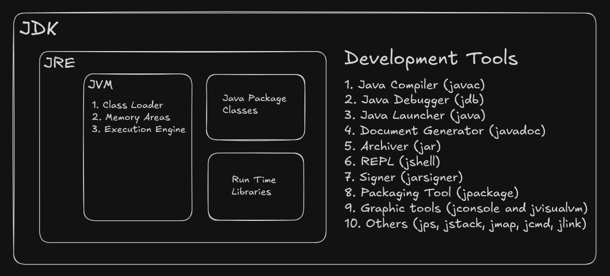

## Java
Java is a high-level, object-oriented programming language developed by Sun Microsystems (now owned by Oracle) for building platform-independent applications.

It follows the principle "Write Once, Run Anywhere (WORA)", allowing Java programs to run on any device with a Java Virtual Machine (JVM).

## Internals of Java

### JDK (Java Development Kit):
JDK is a software package used to develop, compile, and run Java applications. It includes the JRE, compiler (javac), debugger, and other development tools.

### JRE (Java Runtime Environment):
JRE provides the environment required to run Java programs. It contains the JVM and supporting libraries but does not include development tools like the compiler.

### JVM (Java Virtual Machine):
JVM is the virtual machine that executes Java bytecode and enables Java programs to run on different operating systems. It manages memory, security, and program execution.

### How does a Java program executed?
1. Write a Java program (.java file) in a high-level language.
2. Use `javac` compiler to compile the source code. [More Detailed](2-javac-compiler-detailed.md)
3. Execute the compiled output on JVM. [More Detailed](./3-jvm-detailed.md)
4. The program runs and produces the output.

## References

https://www.ibm.com/think/topics/jre

https://www.geeksforgeeks.org/java/just-in-time-compiler/

https://www.oracle.com/webfolder/technetwork/tutorials/obe/java/gc01/index.html#overview ⇒ Short Read Garbage Collection

https://docs.oracle.com/cd/E19455-01/806-3461/index.html ⇒ Short Read Internals

https://docs.oracle.com/javase/specs/index.html

https://www.geeksforgeeks.org/java/how-jvm-works-jvm-architecture/

https://www.baeldung.com/javac ⇒ For the options of javac

https://docs.oracle.com/en/java/javase/17/docs/specs/man/javac.html ⇒ For options of javac

Widening, Narrowing, Boxing, Unboxing Conversions