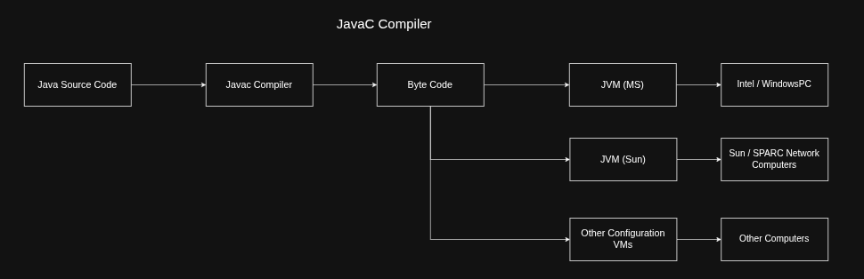
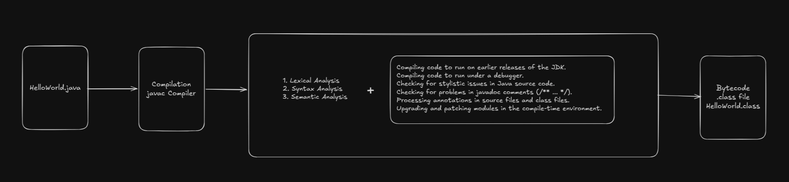

## Compilation (javac)
Java uses a compiler called `javac` to compile the source code to intermediate result called bytecode.

General Phases in any compiler: https://www.geeksforgeeks.org/compiler-design/phases-of-a-compiler/

### `javac` Compiler Options
`javac` options classified into 3 types

1. Standard Options
2. Extra Options
3. Cross Compilation Options

### Standard Options

1. Most standard Options used are:
    1. `-d <target_dir>` : moves the compiled files(class files) to target directory. Also maintains hierarchy of the files
    2. `-verbose` : Shows verbose information about what are the classes loaded and current loading classes.