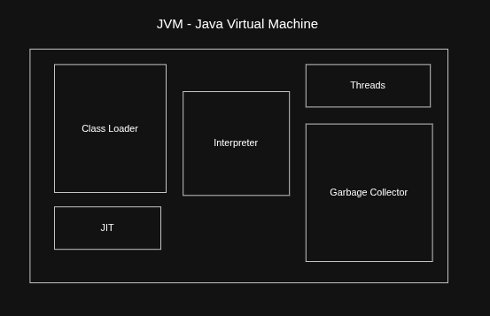

## JVM

## Class Loader

Class loading in Java is the process where the JVM loads class bytecode into memory, links it through verification/preparation/resolution, and initializes static members before the class is used.

## JIT Compiler and Interpreter

1. It generates **optimized machine code** from the bytecode **during the execution** of the program itself (i.e., shortly before the first invocation of a Java method).
2. To transform JVM bytecode into machine code that is executable in a specific hardware architecture, the JVM **interprets the bytecode at runtime** and figures out in which architecture is the program running. This strategy is known as JIT compilation.
3. The default JIT compiler available in the JVM is the Hotspot compiler.
4. **Hotspot JIT Compiler**
    1. The hotspot compiler allows the interpreter to **warm up** the methods by running them thousands of times to get the statistics of each method known as profile information.
    2. Based on the profile information compiler decides which methods needs to be optimized, i.e. if there are two methods(M1, M2), in which M1 is being called from 100 places, M2 is being called from 1 place. So there is no point to optimize M2 before M1.

## AOT Compiler

TODO: refine this section

1. AOT - Ahead of Time Compilation which is compilation strategy used by GraalVM.
2. Generates the native image file directly from source code, all the files are bundled into a single executable which includes application files, java base files, extensions.
3. JVM related binaries will be taken from the Substrate VM and added as well into the native image.
4. Dynamic classes and reflections will not work because at compile time itself all the types should be known.
5. It is usually done for microservices applications, native-image tool does all this packaging which is part of JVM.

## Threads
Threads are light and smallest unit of execution. [More Detailed](../concurrency)

## Garbage Collection
Garbage collection helps to clean the memory time to time. [More Detailed](5-garbage-collection.md)

## Java Program Execution Flow
After bytecode is generated using `javac` compiler. When Java program is executed. The following happens:

### 1. Loading Phase
1. JVM finds the `.class` file and loads the bytecode in binary format into the code segment and create a java.lang.Class object for that class in the heap.
2. For loading the bytecode, java has 3 types of class loaders
    1. **Bootstrap Class Loader**
        1. It is responsible to **load core java classes i.e. native classes** which are implemented in c/c++.
        2. Packages: java.lang.*, java.util.*
        3. Example Classes: String, Object, ArrayList, etc
    2. **Platform (Extension) Class Loader**
        1. It is responsible to load java extension libraries.
        2. Packages: jdk.*, javax.*
    3. **Application Class Loader**
        1. Load classes from the **CLASS_PATH** i.e. the project classes.
        2. Example: Employee, Person, etc
3. Java follows **parent delegation model,** i.e. Child loader first asks parent, Parent tries loading class, If parent fails, child loads it, which prevents duplicate loading of classes and increases security.
4. In summary,
    1. Create a binary stream of data from the class file
    2. Parse the binary data according to the internal data structure
    3. Create an instance of `java.lang.Class`

### 2. Linking Phase
1. Linking refers to the process of taking a binary form of a class or interface and combining it into the runtime state of the JVM.
2. Linking is done in three steps:
    1. **Verification:** Ensures bytecode is safe, no illegal code is present and no memory corruption.
    2. **Preparation:** Allocates memory for static variables and constants in metaspace and assign default values of that type. Example: all int variables with 0, all boolean variables with false.
    3. **Resolution:** It is the process of checking symbolic references from a class to other classes and interfaces, by loading the other classes and interfaces that are mentioned, and checking that the references are correct.
        1. Symbolic references are replaced with actual references. i.e in byte code only symbolic names like
        2. java/lang/String to actual class of String
        3. JVM resolves Employee.work() into actual loaded class metadata, actual method location, runtime callable structure.
        4. All these details are present in the Runtime Constant Pool. This pool is associated to each and every class.

### 3. Initialization Phase
All static variables are initialized with actual default values and static code blocks are executed in this phase. It first initializes all of its superclasses till no super class exists.

> After completion of class loading, class will be available for use.

### 4. Memory Allocation Phase
Heap and Method Area are shared across threads. The JVM stack, PC register, and native method stack are created per thread. The garbage collector reclaims unused heap memory. [More Detailed](4-memory-management.md)

### 5. Execute Phase
The interpreter runs bytecode directly. When a method gets called multiple times, the JIT compiler converts it to native machine code and stores it in the code cache. Native calls go through JNI to reach C/C++ libraries.

### 6. Run Phase
Your program runs on a mix of interpreted and JIT-compiled code. Fast startup, peak performance over time.
