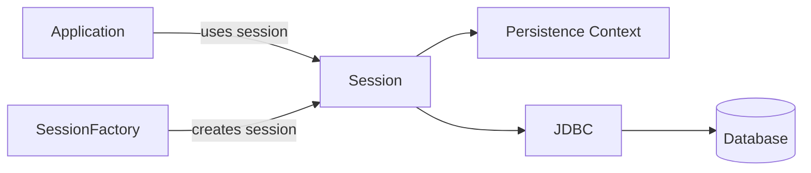
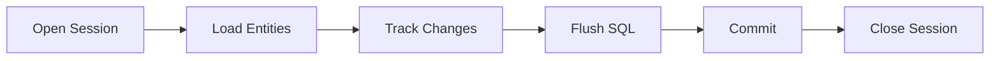
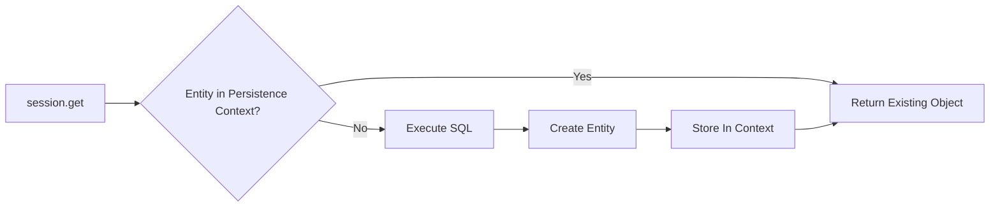
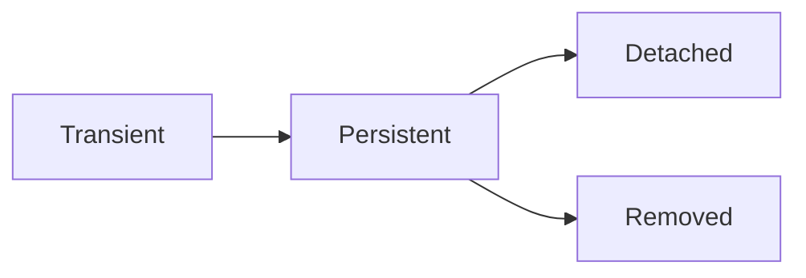
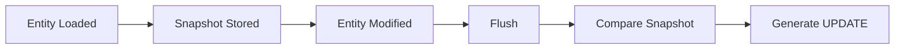

# Hibernate Internals

To understand Hibernate clearly, it is better to know how Hibernate works before and after the introduction of JPA. Before JPA, developers interacted directly with Hibernate APIs such as `SessionFactory`, `Session`, and `Transaction`. Many of these concepts still exist today and form the foundation of Hibernate's internal architecture.

# Core Hibernate Components



## 1. SessionFactory

A `SessionFactory` stores all the configuration, metadata, and rules that hibernate needs to create `Session` objects and interact efficiently with the database.

| Component                             | Description                                                                  |
|---------------------------------------|------------------------------------------------------------------------------|
| **Mapping metadata**                  | Defines which class maps to which table and which field maps to which column |
| **Entity metadata**                   | Information about entities, IDs, relationships, and annotations              |
| **SQL generation information**        | Rules Hibernate uses to generate SQL statements                              |
| **Cache configuration**               | Configuration for first-level and second-level caching                       |
| **Database configuration**            | Database URL, dialect, username, password, and other settings                |
| **Connection provider configuration** | Defines how database connections are obtained and managed                    |

A `SessionFactory` is typically created once during application startup and shared across the entire application.

Building a `SessionFactory` is expensive because Hibernate:

* Scans entity classes
* Builds the metadata model
* Parses annotations or XML mappings
* Creates SQL generation strategies

### Thread Safety

`SessionFactory` is thread-safe.

A single `SessionFactory` instance can safely serve:

```text
100
1000
10000
concurrent requests
```

---

## 2. Session

A `Session` is a lightweight, non-thread-safe object that represents a single unit of work with the database. It manages a Persistence Context and is responsible for loading, tracking, saving, deleting, and flushing entities.

Whenever a database operation needs to be performed, a new `Session` is typically created.

In most applications, the Session scope is request-based, meaning a new Session is created for each incoming request.

### Session Lifecycle



---

## 3. Persistence Context

A Persistence Context is Hibernate's in-memory workspace where it keeps track of managed entities, their state, and any changes made to them during a unit of work.

You can think of it as an in-memory map that stores entities using **Entity Type + Primary Key** as the key.

Conceptually:

```java
{
   User#1 -> User Object,
   User#2 -> User Object,
   Order#100 -> Order Object
}
```

The Persistence Context is responsible for several important features.

---

### 1. First-Level Cache

The Persistence Context acts as Hibernate's **first-level cache**, preventing repeated database queries within the same Session.

```java
User user1 = session.get(User.class, 1L);
User user2 = session.get(User.class, 1L);
```

The first call fetches the entity from the database and stores it in the Persistence Context.

The second call returns the existing entity from memory without executing another SQL query.



---

### 2. Entity State Management

Hibernate manages entities through four different states:



#### a. Transient

Entities in the **Transient** state are not managed by Hibernate.

When an entity object is created using the `new` keyword, it is in the Transient state.

```java
User user = new User();
```

At this point, the object exists only in memory and is not part of the Persistence Context.

---

#### b. Persistent (Managed)

When an entity is saved or loaded using Hibernate, it becomes **Persistent (Managed)** and is added to the Persistence Context.

```java
User userToCreate = new User();
session.save(userToCreate);
```

For the above code:

* Hibernate schedules an INSERT operation.
* The entity is added to the Persistence Context.
* Hibernate begins tracking changes made to the object.

Similarly:

```java
User user = session.get(User.class, 1L);
```

The retrieved entity becomes Managed and is tracked by Hibernate.

---

#### c. Detached

When the Session is closed, all Managed entities become **Detached**.

```java
session.close(); // Entity tracking stops
```

The Java objects still exist in memory, but they are no longer available in the Persistence Context, and Hibernate stops tracking changes made to them.

---

#### d. Removed

When an entity is deleted using Hibernate, its deletion is scheduled and its state changes to **Removed**.

```java
session.delete(user);
```

The entity remains in the Persistence Context until flush/commit, after which it is removed from the database.

---

### 3. Dirty Checking

When an entity becomes Managed, Hibernate stores an internal snapshot of its original state in the PersistenceContext.

If the entity is modified, the changes are updated in the heap memory, Hibernate compares the current state which is in memory with the stored snapshot in the PersistenceContext during the flush phase.

If differences are detected, Hibernate automatically generates the required `UPDATE` statement.

```java
User user = session.get(User.class, 1L);

user.setName("Alex");
```



This mechanism is known as **Dirty Checking**.

---

### 4. Identity Guarantee

The Persistence Context guarantees that only **one Java object exists for a given database row within a Session**.

This is known as the **Identity Guarantee**.

For example, if two separate objects represented the same database row, Hibernate could face consistency issues when both objects are modified. During flush, it would be unclear which changes should be written to the database.

To prevent this, Hibernate always returns the same managed instance for a given entity type and primary key within a Session.

---

# Plain Hibernate Code Flow

In plain Hibernate, interacting with the database generally involves the following steps:

```java
Session session = sessionFactory.openSession(); // Step 1
Transaction tx = session.beginTransaction();    // Step 2

try {
    Employee emp = session.get(Employee.class, 1L); // Step 3

    emp.setName("John"); // Step 4

    tx.commit(); // Step 5
} catch (Exception e) {
    tx.rollback(); // Step 6
} finally {
    session.close(); // Step 7
}
```

## Explanation

### Step 1

Creates a new `Session`, initializes a new Persistence Context, and starts a new unit of work.

### Step 2

Begins a database transaction and associates the Persistence Context with that transaction.

### Step 3

Loads the entity from the database, stores it in the Persistence Context, and marks it as Managed.

### Step 4

Modifies only the entity object in the heap.

Hibernate does **not** immediately execute SQL. Instead, the change is tracked through Dirty Checking during flush phase.

### Step 5

Calling `commit()` first triggers an automatic flush.

#### Flush Phase

During the flush phase, Hibernate synchronizes the state of managed entities in memory with the database.

A flush can occur:

* Automatically (before commit)
* Manually (`session.flush()`)

A flush does **not** end the transaction.

During flush:

1. Hibernate compares the current entity state with the original snapshot.
2. Dirty Checking identifies modified fields.
3. Hibernate generates the required SQL statements.
4. The generated SQL is executed against the database.

#### Commit Phase

After a successful flush, the database transaction is committed.

At this point, the changes become permanent in the database.

---

### Write-Behind Strategy

Hibernate follows a **write-behind strategy**.

Instead of executing SQL immediately after every entity modification:

* Changes accumulate inside the Persistence Context.
* SQL execution is delayed until flush time.
* Statements can be batched together.

This reduces database round trips and improves performance.

### Step 6

Rolls back the transaction and prevents pending changes from being committed.

### Step 7

Closes the Session.

This destroys the Persistence Context, and all Managed entities become Detached.

---

# Transaction Boundary

A Transaction Boundary defines the scope between `beginTransaction()` and `commit()` (or `rollback()`), within which all database operations are treated as a single unit of work.

```java
Session session = sessionFactory.openSession(); // Session Boundary Start

Transaction tx = session.beginTransaction(); // Transaction Boundary Start

Employee emp = session.get(Employee.class, 1L);
emp.setName("John");

tx.commit(); // Transaction Boundary End

session.close(); // Session Boundary End
```

### Boundary Visualization

```text
                Session Boundary
|----------------------------------------------------|
openSession()                               session.close()

                Transaction Boundary
      |------------------------------------|

      beginTransaction()        commit()/rollback()
```

The Session can exist before and after a transaction, but the transaction boundary strictly defines the period during which database changes are part of a single atomic unit of work.


# Important Session Methods in Core Hibernate

The concepts of entity states, Persistence Context, Dirty Checking, and transaction management have already been covered above. The following table focuses on the most commonly used `Session` methods and how they interact with the Persistence Context.

| Method           | Purpose                                                                                                                 |
|------------------|-------------------------------------------------------------------------------------------------------------------------|
| `get()`          | **Already discussed above.** Immediately loads an entity from the database and returns `null` if no record exists.      |
| `load()`         | Returns a proxy object. The actual database query is delayed until a property of the entity is accessed.                |
| `save()`         | **Already discussed above.** Makes a transient entity persistent and schedules an INSERT operation.                     |
| `persist()`      | Similar to `save()`, but follows JPA semantics and does not return the generated identifier.                            |
| `update()`       | Reattaches a detached entity to the current Session so Hibernate can track changes again.                               |
| `merge()`        | Copies the state of a detached entity into a managed entity and returns the managed instance.                           |
| `delete()`       | **Already discussed above.** Marks an entity for deletion and schedules a DELETE operation.                             |
| `flush()`        | **Already discussed above.** Synchronizes the Persistence Context with the database without committing the transaction. |
| `clear()`        | Removes all managed entities from the Persistence Context, making them detached.                                        |
| `evict()`        | Removes a specific entity from the Persistence Context while leaving other managed entities unaffected.                 |
| `refresh()`      | Reloads the latest entity state from the database and discards any in-memory modifications.                             |
| `contains()`     | Checks whether a particular entity is currently managed by the Session.                                                 |
| `saveOrUpdate()` | Lets Hibernate decide whether to perform an INSERT or UPDATE based on the entity state.                                 |
| `lock()`         | Associates a detached entity with the Session without forcing an update.                                                |
| `close()`        | **Already discussed above.** Closes the Session and destroys the Persistence Context.                                   |

---

# Single Example Using Most Important Methods

```java
Session session = sessionFactory.openSession();
Transaction tx = session.beginTransaction();

try {

    // save()
    User newUser = new User();
    newUser.setName("John");
    session.save(newUser);

    // get()
    User user1 = session.get(User.class, 1L);

    // load()
    User user2 = session.load(User.class, 2L);

    // contains()
    boolean managed = session.contains(user1);

    // evict()
    session.evict(user1);

    // update()
    session.update(user1);

    // merge()
    User mergedUser = (User) session.merge(user1);

    // refresh()
    session.refresh(mergedUser);

    // saveOrUpdate()
    session.saveOrUpdate(mergedUser);

    // lock()
    session.lock(mergedUser, LockMode.NONE);

    // delete()
    session.delete(user2);

    // flush()
    session.flush();

    // clear()
    session.clear();

    tx.commit();

} catch (Exception e) {

    tx.rollback();

} finally {

    session.close();
}
```

---

# Persistence Context Control Methods

The methods below directly affect the Persistence Context and are often considered the most important from an internals perspective:

| Method       | Effect on Persistence Context                  |
|--------------|------------------------------------------------|
| `save()`     | Adds entity to Persistence Context             |
| `persist()`  | Adds entity to Persistence Context             |
| `get()`      | Loads entity into Persistence Context          |
| `load()`     | Loads proxy into Persistence Context           |
| `update()`   | Reattaches detached entity                     |
| `merge()`    | Creates/returns a managed copy                 |
| `delete()`   | Marks entity as Removed                        |
| `evict()`    | Removes one entity from Persistence Context    |
| `clear()`    | Removes all entities from Persistence Context  |
| `flush()`    | Synchronizes Persistence Context with database |
| `refresh()`  | Replaces managed state with database state     |
| `contains()` | Checks whether entity is managed               |
| `close()`    | Destroys entire Persistence Context            |

