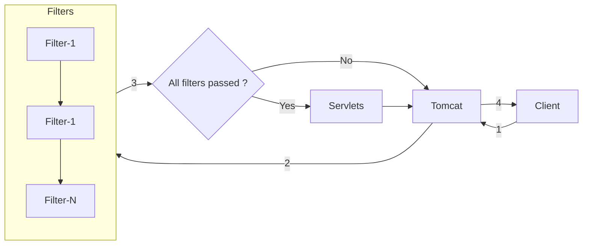

## Filters

- Filters are available from servlet technology and are used to perform some logic on an incoming request or outgoing response.
- Common logic to perform on incoming request before reaching controller are:
  - Log the request
  - Authenticate user
- Common logic to perform on outgoing response before reaching tomcat after controller execution are:
  - Add request id to the response headers
- Filters doesn't know about which controller is being called etc., so logic which is common to all controllers should be performed here.

### What information does filters know?
Some of the information includes:
1. About the request, its headers, cookies, method, body, endpoint
2. About the response object

### Outcomes of the filters
There are two outcomes once the filter is executed.
1. Allow the request to continue further.
2. Block the request reaching controller.

## Filter flow in code
To create a filter create a class which extends the `jakarta.servlet.Filter`.
1. There are three methods `init`, `doFilter` and `destroy`.
2. Mainly we override the `doFilter` method which takes `ServletRequest`, `ServletResponse` and `FilterChain` parameters.
3. Entire filter logic will reside in the `doFilter` method.
4. `FilterChain` object provides the `doFilter` method which divides our filter logic into two parts.
   1. First part, logic written before the `doFilter` is used to perform on incoming request.
   2. Second part, logic written after the `doFilter` is used to perform on outgoing response.
5. Coming to outcome of the filters
   1. If we want to **allow the request** to continue further, **call the `doFilter` method of `FilterChain`**.
   2. If we want to **abort the request**, **write the response into `ServletResponse` object and return from the filter**.
> As filters deal with raw request and response so we need to typecast them to `HttpServletRequest` and `HttpServletResponse`.

## Filter Mapping
- When working with servlets, we can configure multiple servlets, hence we have to map the filter with `@WebFilter("route")` annotation.
- In spring, no need to map as there is only one servlet i.e. `DispatcherServlet`. **Just declare it as a bean**.

## ServletRequest Object
- `ServletRequest` is a readonly object, meaning we can read the information about the request. For example, method, headers, cookies, body etc.
- Request body will be available as `InputStream` in the object. Because body can be a JSON, XML, audio, video or anything. So tomcat stores it as input stream of bytes.
- To consume the request body we can use `InputStream` or `BufferedReader`.
- Once a request body is consumed then, it can't be consumed again.

## About Response Object modification after doFilter of FilterChain
- Do not change response object after the filterChain doFilter is called, because  
  - The response may already be committed after filterChain.doFilter() returns, which means the server has started sending the response to the client.
  - The response body may have already been written to the output stream, so modifying response content at that point won't affect what the client receives. 
  - **Whether it works can depend on buffering, so modifications after doFilter() can behave inconsistently—working for some responses and failing for others.**
- So perform the modifying logic like adding headers before calling `doFilter` of `FilterChain`.