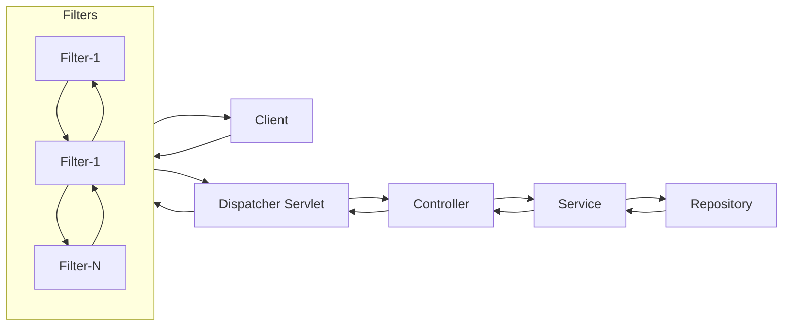

## Filters

Filters is covered in depth in servlet/filters.

Some of the features specific to spring about the filters are as follows:

## Filter Ordering
The execution order of filters can be controlled using the `@Order` annotation. Filters with lower order values are executed before those with higher values.

## Filter Registration
1. Filter class should implement the `Filter` interface from `jakarta.servlet`.
2. And it should be available in the IoC Container
   1. Can be registered by declaring the filter class with `@Component`. 
   2. Or from the configuration file by declaring a bean for `FilterRegistrationBean<FilterClassName>`. In this class itself we can set properties of filer such as order, name of the filter, url pattern for the filter etc.
    ```java
    // First way to declare a filter
    @Component
    @Order(1)
    class FilterA implements Filter{
        @Override
        public void doFilter(ServletRequest request, ServletResponse response, FilterChain filterChain){
        //     ....
        }
    } 
    
    // Second way to declare a filter
    class FilterB implements Filter{
        @Override
        public void doFilter(ServletRequest request, ServletResponse response, FilterChain filterChain){
            //     ....
        }
    }
    @Configuration
    class AppConfig{
        @Bean
        public FilterRegistrationBean<FilterB> filterBFilterRegistrationBean(){
            FilterRegistrationBean<FilterB> filterRegistrationBean = 
                    new FilterRegistrationBean<FilterB>();
            filterRegistrationBean.setFilter(new FilterB());
            filterRegistrationBean.setOrder(1);
            filterRegistrationBean.setName("FilterB");
            filterRegistrationBean.addUrlPatterns("/api/*, /admin/*");
            
        }
    }
    ```

## Response Object Modification In filters
- By default, modifications to the response after `FilterChain.doFilter()` may not be reflected because the response could already be committed. 
- To support inspecting or modifying the response after the filter chain has executed, Spring provides response wrapper classes such as `ContentCachingResponseWrapper`. (Not a good practice.)

## Spring Specific Filters
In order to avoid type-casting of `ServletRequest` and `ServletResponse` to respective `HttpServletRequest` and `HttpServletResponse` spring provides a filter class called `OncePerRequestFilter`.

To use this, extend the filter class with `OncePerRequestFilter`.

### Features of `OncePerRequestFilter`:
  - Provides `HttpServletRequest` and `HttpServletResponse` directly. No need to typecast.
  - Provides a method `shouldNotFilter` which tells whether the filter should execute or not.