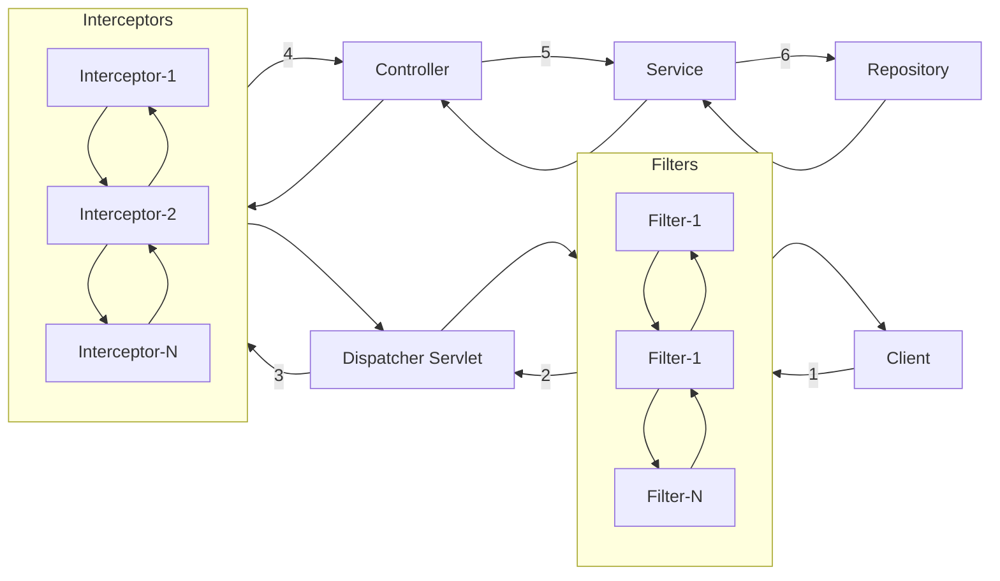
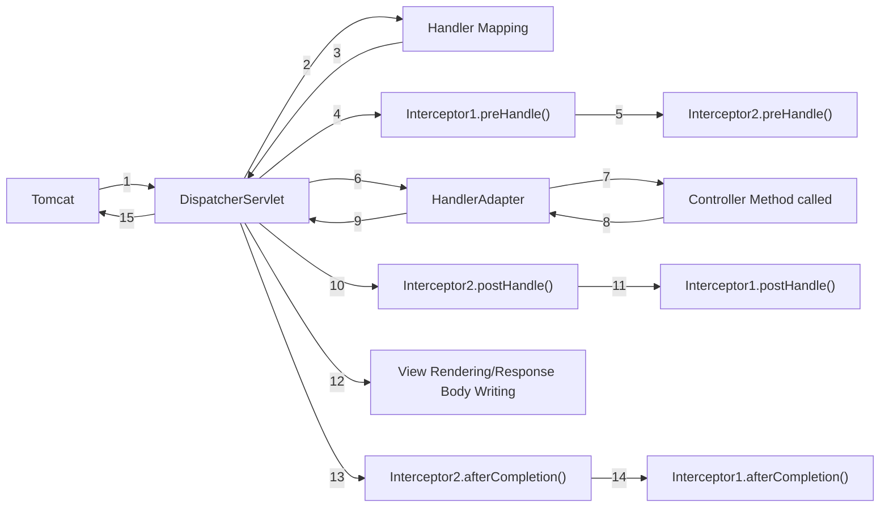

## Interceptors

Interceptors are introduced as part of Spring MVC. These are very similar to that of filters with more knowledge.

Interceptors knows, what is the controller and what method is going to handle the request.

All the functionalities that are performed in filters can be performed here as well. Some of them are as follows:
- More verbose logging with controller name, method name.
- Authorization specific to the controller.
- API response time for particular request.

## Creating a Interceptor
1. To create a interceptor we need to implement the `HandlerInterceptor` interface.
2. Create a configuration class and implement `WebMvcConfigurer`.
3. Create a variable to hold the interceptor and inject the dependency using constructor injection.
4. Override the method `addInterceptors` and add the injected interceptor to `InterceptorRegistry`.
```java
// Create the interceptor
@Component
class AuthInterceptor implements HandlerInterceptor{
    @Override
    public boolean preHandle(HttpServletRequest servletRequest, HttpServletResponse servletResponse, Object handler){
        //...
    }
    @Override
    public void postHandle(HttpServletRequest servletRequest, HttpServletResponse servletResponse, Object handler, ModelAndView modelAndView){
        //...
    }
    @Override
    public void afterCompletion(HttpServletRequest servletRequest, HttpServletResponse servletResponse, Object handler, Exception ex){
        //...
    }
}

// Configure the Interceptor
@Configuration
class WebConfig implements WebMvcConfigurer{
    private AuthInterceptor authInterceptor;
    public WebConfig(AuthInterceptor authInterceptor){
        this.authInterceptor = authInterceptor;
    }
    
    @Override
    public void addInterceptors(InterceptorRegistry interceptorRegistry){
        interceptorRegistry.addInterceptor(authInterceptor)
                .addPathPatterns("/api/**")
                .excludePathPatterns("/api/login")
                .order(1);
    }
}
```
- Here the url patterns are different compared to that of the filters.
  - `/api/**`: Match all the requests starts with `/api`.
  - `/api/*`: Match only the requests `/api/anything` but does not match `/api/anything/anything`
  - `/api`: Exact match of `/api`.

## Ordering Interceptors
Ordering can be done in the configuration file.

## Interceptor Methods
### 1. preHandle
- Logic to perform before the controller is called.
- Specifically, after the `HandlerMapping` gave the mapping to `DispatcherServlet` and before the `HandlerAdapter` calls the mapped method.
- It receives `HttpServletRequest`, `HttpServletResponse` and `Object handler`.
- If we want to continue further, we will return `true` from here.

### 2. postHandle
- Logic to perform immediately after the controller execution is called.
- It receives `HttpServletRequest`, `HttpServletResponse`, `Object handler` and `ModelAndView`.
- `ModelAndView` will have information related to the view being sent to client, like view name etc., we can modify the view from the interceptor as well. If a REST API is built its value will be `null`.

### 3. afterCompletion
- Logic to perform after the entire response is built.
- In REST APIs, we can use this method to perform logic after controller execution is done.

### Handler Object
- The handler is of type object because handler can be of any type based on the application we are building.
    - If it is a REST api, then handler will be the controller.
    - If it is a static resource, then handler will be a static resource.
- Specific to REST api we can type-cast the object to `HandlerMethod` which will give information about the controller and method.

## In Depth Flow
