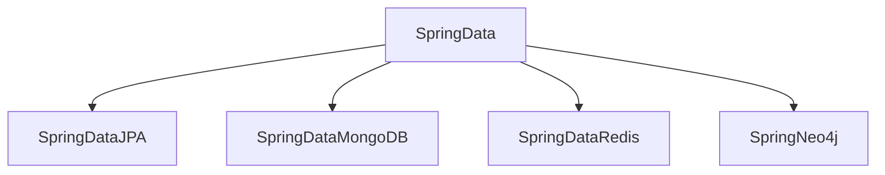
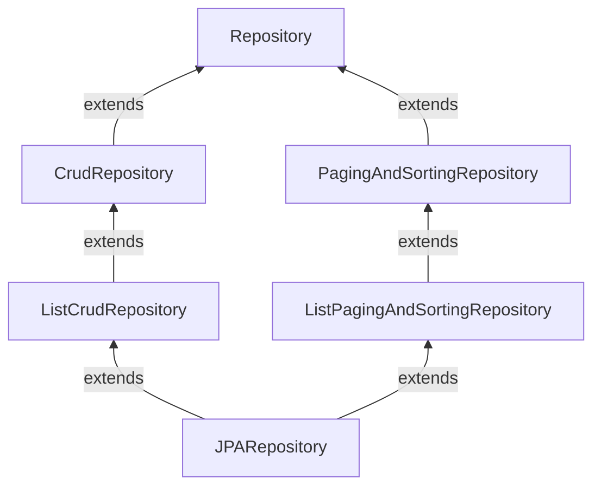

## JPA Repositories
TODO: Check the grammar, typos and syntax issues 

In hibernate we eliminated a lot of boilerplate
code but there is one more issue.

Consider any repository we always have to write the basic methods such as create, read, update and delete which is same code for all different repositories.

To solve this problem spring introduces some interfaces and ask us to extend them. And there is no need to implement any methods for basic method. Spring provides implementation for them at runtime because these simple methods doesn't change.

Spring Data is an umbrella term which provides a interface model for any persistence technologies.


Spring Data provides the interfaces and the respective modules provide runtime implementations for them.

Main interfaces provided by JPA

1. Repository: It is just a marker interface and does not contain any methods.
   It just marks the interface with generics.
   Repository<EntityClassName, PrimaryKeyDataType>
```java
interface UserRepository extends Repository<User,Long>
```
If our repository extends the Repository interface we cannot use any method until we declare that method in our repository.
if we write save(user) or findById(Long id).
If we observe we never provided the implementation of the method. But the jpa knows how to generate sql based on the method name in the interface.

2. CrudRepository: Crudrepository extends Repository and gives some basic methods. They are `save`, `saveAll`, `findById`, `existsById`, `findAll`, `findAllById`, `count`, `deleteById`, `deleteAllById`, `deleteAll`.

In the CrudRepository the findAll, saveAll, findAllById whatever the method which returns more than one entity will return an iterable.

3. ListCrudRepository: ListCrudRepository extends CrudRepository and just overrides the methods which returns iterable and changes the return type to List.

4. PagingAndSortingRepository:
   We use pagination concept to fetch data in chunks from large data set.
   This interface provides two methods
1. Iterable<T> findAll(Sort sort)
2. Page<T> findAll(Pageable pageable)

5. ListPagingAndSortingRepository:
   Same as PagingAndSortingRepository but provides List of entities instead of iterable.

6. JpaRepository:
   Extends both ListCrudRepository and ListPagingAndSortingRepository to provide methods for CRUD operations, pagination, sorting.
   Along with these some others methods are also provided:
1. flush(): flushes the entity changes in persistence context to db.
2. saveAndFlush(): updates the persistence context and flushes it to db.
   etc.

Spring Data JPA Responsibilities
1. Providing Common CRUD operations
2. Creating Repository implementations
3. Deriving Queries from method names
4. Executing custom queries
5. Supports Pagination and Sorting

How does spring provide implementation at runtime?
Actually when spring starts DI, it checks that if there is a repository, then injects a proxy instead of repository.
There is a concrete class called SimpleJpaRepository which implements JpaRepository and overrides all the methods in JpaRepository and provide implementations.

Now as spring injected the proxy, whenever a method is called on the proxy, it does two things:
1. If method is a standard method which exists in JpaRepository then calls the SimpleJpaRepository method.
2. Otherwise delegates the work to a class which can create queries based on the method name.

How does query gets generated based on method name?
The parsing engine works under the hood to parse and create queries.
The method name should be as follows:
subject+adverb+predicate+operators
1. subject can be find, exists, count, delete, findTop3, findDistinct etc.
2. adverb - write something here
3. predicate - can be any attribute from the entity class.
4. operator -  any operator supported by sql example: and, not, or, like, greaterThan, containing, startsWith, endsWith, in, notin, null, notnull, orderBy etc.

Custom Queries
Why do we need custom queries when we can generate the query using method name.
For simple methods it is fine but what if the
query is too large and method name becomes very large.

So we have given an option to write a manual custom query.
There are two types of queries can be written:
1. SQL Queries
2. JPQL Queries

We will make use of @Query annotation to write custom queries.
@Query(query, nativeQuery = true);
query = "select * from student where email = :email"
Optional<Student> findByEmail(@Param("email") String email)

Here the email in the query should be mapped with any of the method argument with @Param annotation.

Other way to achieve this is as below:
query = "select * from student where email = ?1".
Here we can add 1,2,3,... and so on which the method argument 1,2,3.. at their respective place in the query.

JPQL(Jakarta Persistence Query Language)
In native query we need to use table names, actual attributes of the table.
Instead in JPQL we can write queries based on the entity and its properties.

example:
query = select s from Student s where s.email = :email

We can perform two types of joins in JPQL.
1. Explicit Joins
   select s from Student s JOIN s.department d where d.active = true

2. Implicit Joins
   select s from Student s where s.department.active = true. No need to use join keyword here. this will be converted to actual SQL later.

Sorting
We can use Sort class for sorting purpose.
static methods
1. by(string propertyName)
2. by(Sort.Direction, String propertyName)
3. chaining the sort using ascending descending etc.

Sort sort = Sort.by("age");
Sort sort = Sort.by(Sort.Direction.ASC, "age");
Sort sort = Sort.by("age").ascending().and(Sort.by("name").descending));

Pagination
When there are millions of records we can't fetch all the records because we can't store all of them in memory.
So we fetch them in chunks. Main two things
1. pageNumber: Skips pageNumber*pageSize and returns the remaining pageSize records
   Page Number starts with 0 in java.
2. pageSize: Number of records to fetch for a chunk.

We have Pageable interface for this.
Implementation is given by PageRequest.
Methods of PageRequest.
Pageable pageable = PageRequest.of(pageNumber, pageSize);
We have overloads for Sort as well here.

When pageable is used to fetch records. It returns a Page.

Page<Student> page = studentRepo.findActiveTrue(pageable);

page.getContent();
page.getNumber();
page.getSize();
page.getNumberOfElements();
page.getTotalElements();
page.getTotalPages();
page.hasNext();
page.hasPrevious();
page.isFirst();
page.isLast();
page.getTotalElements(); // total number of records

Page is child interface of Slice. Slice has some less methods i.e. getTotalElements and getTotalPages.

When Page is used two queries will be fired one is for fetching data for page and another is to count how many total elements(records) exists.

If we don't need total number of elements we can simply use Slice instead of Page.