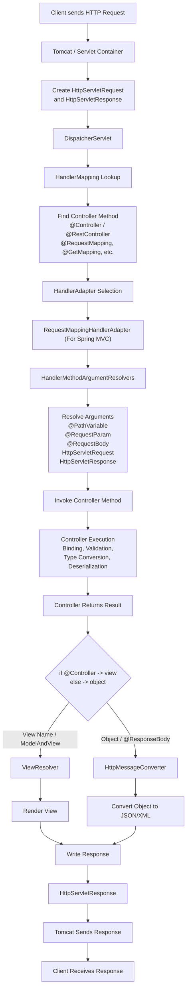

## Detailed Application Flow

1. **Client sends an HTTP request**
    - The request reaches the web server/container (e.g., Tomcat).
    - Tomcat creates `HttpServletRequest` and `HttpServletResponse` objects.
2. **Request is received by `DispatcherServlet`**
   - `DispatcherServlet` acts as the **Front Controller** of Spring MVC.
    - All incoming requests are routed through it.
3. **Handler mapping lookup**
    - `DispatcherServlet` asks a `HandlerMapping` implementation to find the appropriate handler (controller method) for the request URL and HTTP method.
    - Implementation of `HandlerMapping` scans and finds the beans in IoC container annotated with `@Controller` or `@RestController` .
    - Spring examines methods annotated with `@RequestMapping`, `@GetMapping`, `@PostMapping`, etc. and creates the mappings between request patterns (URL, HTTP method, headers, consumes/produces conditions) and the corresponding controller methods.
4. **Handler adapter selection**
    - After a handler is found by HandlerMapping, `DispatcherServlet` does not invoke it directly. 
    - Instead, it looks for a suitable HandlerAdapter, which acts like a plug/bridge between DispatcherServlet and the actual handler. 
    - Since Spring MVC controllers (`@Controller` / `@RestController`) are represented as handler methods, Spring typically selects `RequestMappingHandlerAdapter`. 
    - `RequestMappingHandlerAdapter` is responsible for preparing everything needed before the controller method is called. 
    - Internally, it uses a collection of `HandlerMethodArgumentResolvers` to resolve method parameters such as:`@PathVariable`,`@RequestParam`,`@RequestBody`,`HttpServletRequest`,`HttpServletResponse`,`Principal` and many others. 
    - Once all arguments are resolved, the adapter invokes the controller method with the resolved values.
5. **Controller method execution**
    - The `HandlerAdapter` invokes the mapped controller method.
    - Spring performs parameter binding, validation, type conversion, and deserialization (e.g., JSON → Java object) before calling the method.
6. **Controller returns a result**
    - The controller may return:
        - A view name (`String`, `ModelAndView`)
        - A Java object (`@ResponseBody` / `@RestController`)
        - Other supported return types
7. **Response processing**
    - For traditional MVC applications:
        - `DispatcherServlet` uses a `ViewResolver` to locate the view.
        - The view is rendered and the response is generated.
    - For REST APIs:
        - Spring uses `HttpMessageConverters` (e.g., Jackson) to convert Java objects into JSON.
8. **Response sent back to client**
    - `DispatcherServlet` writes the final output to `HttpServletResponse`.
    - Tomcat sends the HTTP response back to the client.**