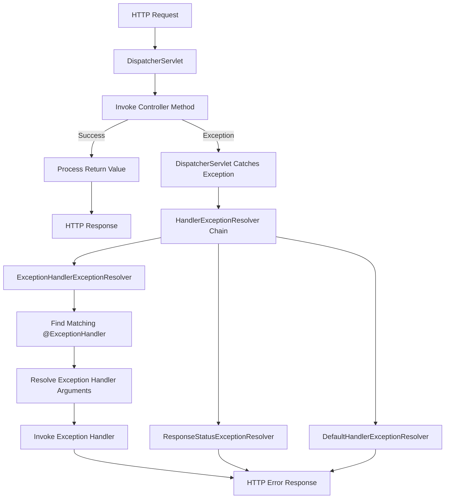

# Global Exception Handling

## Default Exception Handling

- When there is an exception which is not handled properly in spring mvc application then spring redirects it to `/error` route.

- The `/error` endpoint is handled by spring boot default error controller `BasicErrorController`.

- It checks the `Accept` header and returns the response as JSON response or white label error page based on the header.

## Exception Flow


## Exception Handling With @ExceptionHandler.
1. Create an advice class. 
2. Create a method and annotate it with `@ExceptionHanlder` annotation.
3. Perform business logic and return the response.
4. Example
   ```java
    @RestControllerAdvice
    public class GlobalExceptionHandler{
        @ExceptionHandler(Exception.class)
        public ResponseEntity<String> handleException(Exception ex){
            return ResponseEntity.status(500)
                    .body(ex.getMessage());
        }    
    }
    ```
5. Whatever the unhandled exception reaches the controller will be handled by this handler which returns a response of status 500 and exception reason.

## @ExceptionHandler
1. Single handler can handle multiple exceptions.
    ```java
    @ExceptionHandler({
        IllegalArgumentException.class,
        IllegalStateException.class
    })
    ```
### What if multiple handlers exist for a single exception
1. **In same Advice/file:** Spring fails to start saying **Ambiguous @ExceptionHandler method mapped for [class ExceptionClassName]**.
2. **In different Advices/files:** The handler execution can be controlled using `@Order`. If no ordering is given we cannot predict which handler will be executed.

## Exception Handling With @ResponseStatus
1. Annotate a custom exception with `@ResponseStatus`:
    ```java
    @ResponseStatus(HttpStatus.NOT_FOUND)
    public class UserNotFoundException extends RuntimeException {
    
        public UserNotFoundException(String message) {
            super(message);
        }
    }
    ```
2. Whenever the exception is thrown `throw new UserNotFoundException("User not found");`. 
3. Spring's `ResponseStatusExceptionResolver` sees the exception, finds the annotation, and automatically returns `HTTP/1.1 404 Not Found` without requiring an `@ExceptionHandler`.
4. Instead of creating a custom exception class:
    ```java
    throw new ResponseStatusException(
            HttpStatus.NOT_FOUND,
            "User not found");
    ```
5. This is also handled by `ResponseStatusExceptionResolver`.

## Default Spring MVC Exception Handling
1. Spring's `DefaultHandlerExceptionResolver` handles many framework exceptions automatically.
2. **Example**: `HttpRequestMethodNotSupportedException   (Wrong HTTP Method)`, `MissingServletRequestParameterException(Missing Request Parameter)`, etc. 